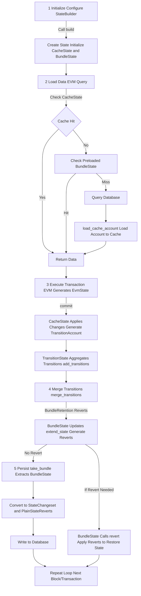

My notes:

工作流程是EVM执行的典型循环：初始化 -> 执行交易 -> 应用变化 -> 合并过渡 -> 持久化捆绑。以下是步骤：

1. 初始化（StateBuilder）：
   - 使用StateBuilder配置数据库、预加载捆绑（with_bundle_prestate）或缓存（with_cached_prestate）、回滚更新（with_bundle_update）。
   - 调用build()创建State，初始化CacheState（内存缓存）和BundleState（捆绑变化）。
2. 加载数据（Database trait）：
   - EVM查询（如basic()、storage()）时，State先查CacheState；若无，查预加载BundleState；再查数据库（database）。
   - 使用load_cache_account()加载账户到缓存，确保后续访问高效。
3. 执行交易（DatabaseCommit trait）：
   - EVM执行产生EvmState（HashMap<Address, Account>）。
   - 调用commit()：CacheState应用变化（apply_evm_state），生成TransitionAccount列表。
   - TransitionState聚合这些过渡（add_transitions），更新账户/存储（update）。
4. 合并过渡（merge_transitions）：
   - 调用merge_transitions(BundleRetention::Reverts)，将TransitionState应用到BundleState。
   - BundleState更新账户（extend_state）、合约，并生成Reverts（apply_transitions_and_create_reverts）。
   - 如果启用后台合并选项（with_background_transition_merge），则可考虑后台处理（取决于具体实现）。
5. 可选回滚处理（revert）：
   - 如果需要回滚（如交易失败），BundleState调用revert()应用Reverts，恢复先前状态（使用AccountRevert的revert()）。
6. 持久化（take_bundle）：
   - 块结束时，调用take_bundle()提取BundleState。
   - BundleState转换为StateChangeset（to_plain_state）和PlainStateReverts（to_plain_state_reverts），写入数据库。
   - 重复循环下一个块/交易。

示例流程：交易创建账户 -> 应用TransitionAccount到CacheState -> 合并到BundleState -> 生成Revert（基于变化，如销毁或修改） -> 持久化变更集到DB。