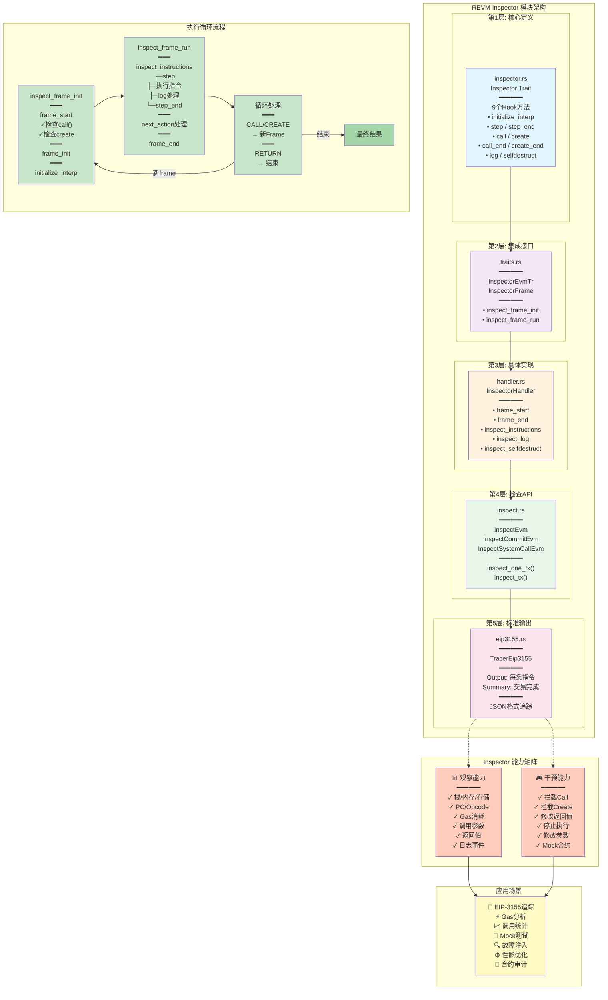

# Revm inspector learning order
_Exported on 1/22/2026 at 14:21:31 GMT+8 from Cursor (2.3.29)_

---

**User**

这是revm，我要学习他的inspector crait，他src下有好多文件，我应该按照什么顺序来学习

---

**Cursor**

我来帮你分析revm中inspector crate的学习路径。让我先看看这个目录下有哪些文件。

现在让我查看各个关键文件的内容，以了解它们之间的关系：

现在让我查看主要的Inspector trait定义：

很好！现在我对inspector crate的结构有了清晰的理解。让我给你推荐一个学习顺序：

## 📚 revm Inspector Crate 学习路径

根据代码结构和依赖关系，这是我推荐的学习顺序：

### **第一阶段：基础概念**

1. **`lib.rs`** ⭐
   - 了解整个crate的模块结构和导出
   - 理解inspector的设计目标："提供一组traits允许检查EVM执行"

2. **`traits.rs`**
   - 定义核心的trait定义（JournalExt等辅助traits）
   - 理解inspector与其他组件的交互接口

3. **`inspector.rs`** ⭐⭐⭐ 最重要
   - Inspector trait的核心定义，包含所有hooks：
     - `initialize_interp()` - 初始化
     - `step()` - 每步执行前
     - `step_end()` - 每步执行后
     - `log()` - 日志事件
     - `call()` / `call_end()` - 合约调用
     - `create()` / `create_end()` - 合约创建
     - `selfdestruct()` - 自毁
   - 也包含tuple组合实现（允许多inspector组合）

### **第二阶段：具体实现例子**

4. **`noop.rs`**
   - 最简单的Inspector实现（空操作）
   - 学习如何实现Inspector trait

5. **`gas.rs`**
   - 实现gas追踪功能
   - 学习如何通过step hooks收集信息

6. **`count_inspector.rs`** (你已打开)
   - 计数指令的实现
   - 学习如何维护执行状态

### **第三阶段：集成和高级用法**

7. **`handler.rs`** ⭐⭐
   - Inspector与EVM Handler的集成
   - `InspectorHandler` 和 `InspectorEvmTr` trait
   - `frame_start` / `frame_end` / `inspect_instructions` 函数
   - 理解inspector如何被调用

8. **`inspect.rs`**
   - `InspectEvm` / `InspectCommitEvm` / `InspectSystemCallEvm` traits
   - 提供给用户的高层API

9. **`eip3155.rs`** (需要tracer特性)
   - EIP-3155标准tracer实现
   - 实战例子：标准化格式的执行追踪

10. **`mainnet_inspect.rs`**
    - Mainnet环境的集成示例

11. **`either.rs`**
    - Either类型支持（Either<A, B>的Inspector实现）

12. **`inspector_tests.rs`**
    - 单元测试，验证学习成果

---

### 🎯 **快速学习路径** (如果时间有限)

最小集合：
- `inspector.rs` → `noop.rs` → `handler.rs` → `gas.rs`

这4个文件能让你理解：
1. Inspector trait如何定义
2. 如何实现一个inspector
3. inspector如何被集成到EVM中
4. 实际应用示例

---

### 💡 **学习建议**

- 每个文件都读一遍源码注释，revm的注释质量很高
- `inspector.rs` 中的trait方法注释特别详细，一定要仔细读
- 查看`lib.rs`中的测试代码（lines 39-82），看实际使用示例
- 理解 `step()` 和 `step_end()` 的调用时机是关键

你现在打开的`count_inspector.rs`是很好的学习对象！可以看到它如何使用`step()`来计数各种操作。

需要我详细解读某个文件吗？

## 总结

