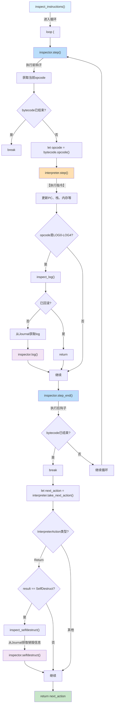
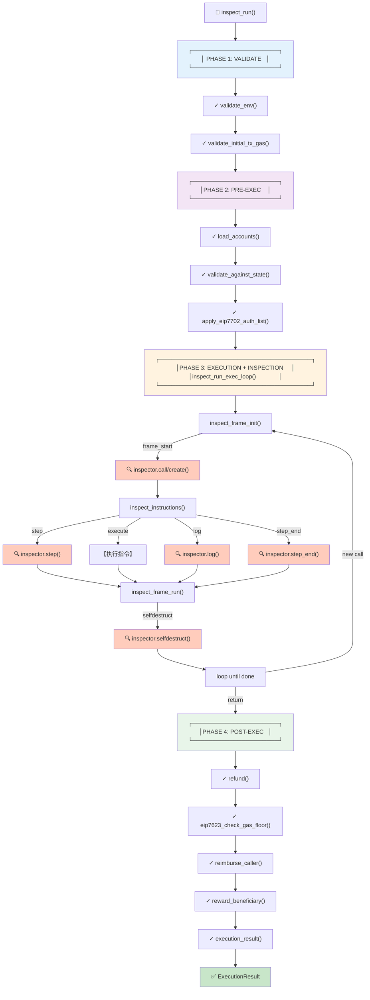

# Revm handler.rs 文件学习要点
_Exported on 1/22/2026 at 16:15:22 GMT+8 from Cursor (2.3.29)_

---

**User**

@crates/inspector/src/handler.rs:1-291 这个项目是revm，我在学习当前的这个文件，有什么是重点的呢，必须学会和理解的

---

**Cursor**

我来帮你分析这个 revm Inspector Handler 文件的重点。让我先查看一些相关的文件，以更好地理解上下文。

很好！现在我对你要学习的内容有全面的理解了。让我为你总结 `handler.rs` 文件的**核心重点**：

## 🎯 Handler.rs 的核心重点

### **1. 文件的核心作用**
这是 Inspector 和 EVM Handler 的**集成枢纽**。它定义了如何在 EVM 执行过程中插入 Inspector 的追踪钩子。

---

### **2. 必须理解的核心内容**

#### **A. InspectorHandler Trait（第30-148行）**⭐⭐⭐
这是整个文件的灵魂。

**关键概念：**
- 这是一个扩展 `Handler` trait 的高级接口，用于支持检查
- 它**复制/改造**了 `Handler` 的主要方法，但在关键点插入 Inspector 调用

**核心方法链（一定要理解执行流程）：**

```
inspect_run() 
  ↓ 
inspect_run_without_catch_error() 
  ↓
[validate] → [pre_execution] → inspect_execution() → [post_execution] → [execution_result]
                                    ↓
                              inspect_run_exec_loop()
                                    ↓
                         inspect_frame_init() / inspect_frame_run()
                         (这里调用Inspector钩子)
```

**关键理解点：**
- `inspect_run()` 是入口点（对应 Handler::run）
- `inspect_execution()` 处理主要执行逻辑
- `inspect_run_exec_loop()` 是帧执行的核心，调用 `evm.inspect_frame_init()` 和 `evm.inspect_frame_run()`

---

#### **B. 三个关键函数（第150-240行）**⭐⭐

| 函数 | 作用 | 何时调用 |
|------|------|--------|
| **frame_start()** | 处理调用/创建的**开始** | call/create 前 |
| **frame_end()** | 处理调用/创建的**结束** | call/create 后 |
| **inspect_instructions()** | 运行解释器循环**逐指令**追踪 | 每个指令执行时 |

**核心理解：**
- 这三个函数是 Inspector 的**具体调用点**
- 它们根据操作类型（Call/Create）调用相应的 Inspector 方法

---

### **3. 必须掌握的执行流程**

```
┌─────────────────────────────────────────────────────────────┐
│ inspect_run()                                               │
│ └─> inspect_run_without_catch_error()                      │
│     ├─> validate()                                         │
│     ├─> pre_execution()                                    │
│     ├─> inspect_execution()                               │
│     │   └─> inspect_run_exec_loop()                        │
│     │       ├─> evm.inspect_frame_init() [第100行]        │
│     │       │   ├─ 调用 frame_start()                     │
│     │       │   ├─ 调用 Inspector::call()                 │
│     │       │   └─ 调用 Inspector::create()               │
│     │       │                                              │
│     │       └─> evm.inspect_frame_run() [第107行] LOOP    │
│     │           └─ 执行指令，追踪每一步                   │
│     │                                                      │
│     ├─> post_execution()                                   │
│     └─> execution_result()                                │
└─────────────────────────────────────────────────────────────┘
```

---

### **4. Inspector 的四大类调用钩子**

**在 inspect_instructions()（第200-240行）中体现：**

1. **initialize_interp** - 解释器初始化时
2. **step** - 执行指令前
3. **step_end** - 执行指令后
4. **log** - 发出日志时（第219-221行）
5. **selfdestruct** - 自毁操作时（第233-237行）

---

### **5. 必须理解的细节点**

| 行数 | 关键点 | 为什么重要 |
|------|--------|----------|
| 19-23 | 文档说明被跳过的方法 | 理解 InspectorHandler 和 Handler 的区别 |
| 95-126 | 循环中的 ItemOrResult 处理 | 理解帧栈如何管理 |
| 156-170 | frame_start 的匹配逻辑 | 理解不同类型操作的区分 |
| 201-240 | inspect_instructions 完整流程 | 理解每步执行的钩子调用 |
| 244-264 | inspect_log 条件检查 | 理解为什么要检查 LOG* 是否回滚 |
| 268-290 | inspect_selfdestruct 逻辑 | 理解从 Journal 读取销毁信息 |

---

### **6. 学习路线**

**第一遍（理解骨架）：**
1. 阅读第12-49行的文档注释
2. 理解 InspectorHandler trait 的四个方法
3. 跟踪执行流程

**第二遍（理解细节）：**
1. 研究 frame_start/frame_end 的分发逻辑
2. 理解 inspect_instructions 的 step/step_end 循环
3. 理解 log 和 selfdestruct 的特殊处理

**第三遍（与其他部分关联）：**
1. 对标 Handler::run 的实现（在 handler crate 中）
2. 查看 InspectEvm 的实现（在 inspect.rs 中）
3. 看实际的 Inspector 实现（gas.rs、count_inspector.rs）

---

### **7. 一句话总结**

**handler.rs 就是一个"代理模式"实现：将 EVM 执行流程的关键点拦截下来，通过 Inspector trait 的回调函数让用户能够在这些点进行观察和追踪。**

---

需要我详细解释某个具体的方法或流程吗？比如 `inspect_run_exec_loop` 中的循环逻辑？

```plaintext
inspect_run() 
  ↓ 
inspect_run_without_catch_error() 
  ↓
[validate] → [pre_execution] → inspect_execution() → [post_execution] → [execution_result]
                                    ↓
                              inspect_run_exec_loop()
                                    ↓
                         inspect_frame_init() / inspect_frame_run()
                         (这里调用Inspector钩子)
```

```plaintext
┌─────────────────────────────────────────────────────────────┐
│ inspect_run()                                               │
│ └─> inspect_run_without_catch_error()                      │
│     ├─> validate()                                         │
│     ├─> pre_execution()                                    │
│     ├─> inspect_execution()                               │
│     │   └─> inspect_run_exec_loop()                        │
│     │       ├─> evm.inspect_frame_init() [第100行]        │
│     │       │   ├─ 调用 frame_start()                     │
│     │       │   ├─ 调用 Inspector::call()                 │
│     │       │   └─ 调用 Inspector::create()               │
│     │       │                                              │
│     │       └─> evm.inspect_frame_run() [第107行] LOOP    │
│     │           └─ 执行指令，追踪每一步                   │
│     │                                                      │
│     ├─> post_execution()                                   │
│     └─> execution_result()                                │
└─────────────────────────────────────────────────────────────┘
```

---

**User**

他跟正常的，不是inspect的handler有啥区别： @crates/handler/src/handler.rs:1-490 

---

**Cursor**

很好的问题！这个对比能帮你深入理解 Inspector 的设计。让我为你详细分析两者的区别。

## 📊 核心区别对比

### **1. 结构层次的区别**

| 角度 | 普通 Handler | Inspector Handler |
|------|------------|-------------------|
| **位置** | `crates/handler/src/handler.rs` | `crates/inspector/src/handler.rs` |
| **职责** | 定义执行流程本身 | 在执行流程中**插入观察点** |
| **关系** | 基础实现 | 扩展基础实现 |

---

### **2. 代码量和方法数**

**普通 Handler：**
- 定义了 17+ 个方法
- 都是虚函数（可被覆盖）
- 专注于"执行逻辑"

**Inspector Handler：**
- 只定义了 **4 个核心方法**
- 都是"包装"方法（调用 evm 的方法）
- 专注于"在执行过程中注入钩子"

---

### **3. 执行流程对比**

#### **普通 Handler 的执行流程：**

```
run()
  ↓
run_without_catch_error()
  ├─ validate()           [验证]
  ├─ pre_execution()      [预执行]
  ├─ execution()          [执行主循环]
  │   ├─ first_frame_input()
  │   ├─ run_exec_loop()
  │   │   ├─ evm.frame_init()    [初始化帧]
  │   │   └─ evm.frame_run()     [运行帧]
  │   └─ last_frame_result()
  ├─ post_execution()     [后执行]
  └─ execution_result()   [输出结果]
```

#### **Inspector Handler 的执行流程：**

```
inspect_run()
  ↓
inspect_run_without_catch_error()
  ├─ validate()              [验证，同普通Handler]
  ├─ pre_execution()         [预执行，同普通Handler]
  ├─ inspect_execution()     [执行主循环+检查]
  │   ├─ first_frame_input()
  │   ├─ inspect_run_exec_loop()
  │   │   ├─ evm.inspect_frame_init()  [初始化帧+检查]
  │   │   │   └─ inspector.call()
  │   │   │   └─ inspector.create()
  │   │   └─ evm.inspect_frame_run()   [运行帧+检查]
  │   │       └─ inspect_instructions()
  │   │           ├─ inspector.step()
  │   │           ├─ [执行指令]
  │   │           └─ inspector.step_end()
  │   └─ last_frame_result()
  ├─ post_execution()        [后执行，同普通Handler]
  └─ execution_result()      [输出结果，同普通Handler]
```

---

### **4. 具体方法对比**

#### **A. 入口方法**

**普通 Handler：**
```rust
fn run(&mut self, evm: &mut Self::Evm) -> Result<ExecutionResult<Self::HaltReason>, Self::Error> {
    match self.run_without_catch_error(evm) {
        Ok(output) => Ok(output),
        Err(e) => self.catch_error(evm, e),
    }
}
```

**Inspector Handler：**
```rust
fn inspect_run(&mut self, evm: &mut Self::Evm) -> Result<ExecutionResult<Self::HaltReason>, Self::Error> {
    match self.inspect_run_without_catch_error(evm) {
        Ok(output) => Ok(output),
        Err(e) => self.catch_error(evm, e),  // 复用普通Handler的catch_error
    }
}
```

**区别：**
- 入口方法名不同（`run` vs `inspect_run`）
- 内部调用不同的实现方法
- 错误处理逻辑相同

---

#### **B. 执行主循环**

**普通 Handler（第366-397行）：**
```rust
fn run_exec_loop(&mut self, evm: &mut Self::Evm, first_frame_input: ...) -> Result<FrameResult, Self::Error> {
    let res = evm.frame_init(first_frame_input)?;    // ← 直接调用frame_init
    
    if let ItemOrResult::Result(frame_result) = res {
        return Ok(frame_result);
    }
    
    loop {
        let call_or_result = evm.frame_run()?;       // ← 直接调用frame_run
        // ... 循环逻辑 ...
    }
}
```

**Inspector Handler（第95-126行）：**
```rust
fn inspect_run_exec_loop(&mut self, evm: &mut Self::Evm, first_frame_input: ...) -> Result<FrameResult, Self::Error> {
    let res = evm.inspect_frame_init(first_frame_input)?;  // ← 调用inspect_frame_init
    
    if let ItemOrResult::Result(frame_result) = res {
        return Ok(frame_result);
    }
    
    loop {
        let call_or_result = evm.inspect_frame_run()?;     // ← 调用inspect_frame_run
        // ... 循环逻辑完全相同 ...
    }
}
```

**核心区别：**
- 调用 `inspect_frame_init` 而不是 `frame_init`
- 调用 `inspect_frame_run` 而不是 `frame_run`
- 这些 inspect_* 方法在 Evm trait 中被定义为在执行过程中**调用 Inspector 钩子**

---

#### **C. 被复用的方法**

**完全相同的方法（复用）：**
- `validate()` - 验证环节
- `pre_execution()` - 预执行环节
- `post_execution()` - 后执行环节
- `execution_result()` - 输出结果
- `catch_error()` - 错误处理
- `validate_env()`, `validate_initial_tx_gas()` 等...

**Inspector Handler 要求自己实现的方法：**
- `inspect_run()` - 替代 `run()`
- `inspect_run_without_catch_error()` - 替代 `run_without_catch_error()`
- `inspect_execution()` - 替代 `execution()`
- `inspect_run_exec_loop()` - 替代 `run_exec_loop()`

---

### **5. 关键的"注入点"对比**

**普通 Handler：**
- 没有任何注入点
- 直接执行 EVM 逻辑

**Inspector Handler 的注入点（通过 frame_start/frame_end/inspect_instructions）：**

| 注入点 | 时机 | 调用的 Inspector 方法 |
|------|------|-------------------|
| `frame_start()` | Call/Create 前 | `inspector.call()` / `inspector.create()` |
| `frame_end()` | Call/Create 后 | `inspector.call_end()` / `inspector.create_end()` |
| `inspect_instructions()` | 每条指令 | `inspector.step()` / `inspector.step_end()` |
| `inspect_log()` | 发出 log | `inspector.log()` |
| `inspect_selfdestruct()` | 自毁操作 | `inspector.selfdestruct()` |

---

### **6. 一个最直观的例子**

假设有个简单的合约调用：

**普通 Handler 执行：**
```
run_exec_loop()
  ├─ evm.frame_init()     [初始化caller->callee的frame]
  └─ evm.frame_run()      [执行callee的bytecode]
      ├─ 执行 PUSH1
      ├─ 执行 ADD
      ├─ 执行 RETURN
      └─ [返回结果]
```

**Inspector Handler 执行：**
```
inspect_run_exec_loop()
  ├─ evm.inspect_frame_init()
  │   └─ frame_start()
  │       └─ inspector.call()  ← 【检查点】观察这个调用
  └─ evm.inspect_frame_run()
      └─ inspect_instructions()
          ├─ inspector.step()          ← 【检查点】执行PUSH1前
          ├─ [执行 PUSH1]
          ├─ inspector.step_end()      ← 【检查点】执行PUSH1后
          ├─ inspector.step()          ← 【检查点】执行ADD前
          ├─ [执行 ADD]
          ├─ inspector.step_end()      ← 【检查点】执行ADD后
          ├─ inspector.step()          ← 【检查点】执行RETURN前
          ├─ [执行 RETURN]
          ├─ inspector.step_end()      ← 【检查点】执行RETURN后
          └─ [返回结果]
```

---

### **7. 本质区别总结**

| 特性 | 普通 Handler | Inspector Handler |
|------|------------|-------------------|
| **代码职责** | 实现执行流程 | 扩展执行流程 |
| **方法数量** | 17+ 个 | 4 个（+3个工具函数） |
| **是否修改执行** | 不修改，只执行 | 不修改，但**观察** |
| **如何实现** | 直接实现业务逻辑 | 调用带有钩子的 `inspect_*` 方法 |
| **主要目的** | 执行交易 | 执行交易 + 追踪过程 |
| **跳过的方法** | 无 | 4 个（都被 inspect_* 替代） |

---

### **8. 为什么设计成这样？**

**设计哲学：最小化差异**
- Inspector 不重新实现整个 Handler
- 只在**关键执行点**插入钩子
- 大部分逻辑（验证、后处理）完全复用
- 只改变"**如何调用 frame_init 和 frame_run**"

这是一个非常优雅的**装饰器模式**设计！

---

需要我深入讲解某个具体的注入点吗？比如 `inspect_log` 或 `inspect_instructions` 的具体实现？

```plaintext
run()
  ↓
run_without_catch_error()
  ├─ validate()           [验证]
  ├─ pre_execution()      [预执行]
  ├─ execution()          [执行主循环]
  │   ├─ first_frame_input()
  │   ├─ run_exec_loop()
  │   │   ├─ evm.frame_init()    [初始化帧]
  │   │   └─ evm.frame_run()     [运行帧]
  │   └─ last_frame_result()
  ├─ post_execution()     [后执行]
  └─ execution_result()   [输出结果]
```

```plaintext
inspect_run()
  ↓
inspect_run_without_catch_error()
  ├─ validate()              [验证，同普通Handler]
  ├─ pre_execution()         [预执行，同普通Handler]
  ├─ inspect_execution()     [执行主循环+检查]
  │   ├─ first_frame_input()
  │   ├─ inspect_run_exec_loop()
  │   │   ├─ evm.inspect_frame_init()  [初始化帧+检查]
  │   │   │   └─ inspector.call()
  │   │   │   └─ inspector.create()
  │   │   └─ evm.inspect_frame_run()   [运行帧+检查]
  │   │       └─ inspect_instructions()
  │   │           ├─ inspector.step()
  │   │           ├─ [执行指令]
  │   │           └─ inspector.step_end()
  │   └─ last_frame_result()
  ├─ post_execution()        [后执行，同普通Handler]
  └─ execution_result()      [输出结果，同普通Handler]
```

```rust
fn run(&mut self, evm: &mut Self::Evm) -> Result<ExecutionResult<Self::HaltReason>, Self::Error> {
    match self.run_without_catch_error(evm) {
        Ok(output) => Ok(output),
        Err(e) => self.catch_error(evm, e),
    }
}
```

```rust
fn inspect_run(&mut self, evm: &mut Self::Evm) -> Result<ExecutionResult<Self::HaltReason>, Self::Error> {
    match self.inspect_run_without_catch_error(evm) {
        Ok(output) => Ok(output),
        Err(e) => self.catch_error(evm, e),  // 复用普通Handler的catch_error
    }
}
```

```rust
fn run_exec_loop(&mut self, evm: &mut Self::Evm, first_frame_input: ...) -> Result<FrameResult, Self::Error> {
    let res = evm.frame_init(first_frame_input)?;    // ← 直接调用frame_init
    
    if let ItemOrResult::Result(frame_result) = res {
        return Ok(frame_result);
    }
    
    loop {
        let call_or_result = evm.frame_run()?;       // ← 直接调用frame_run
        // ... 循环逻辑 ...
    }
}
```

```rust
fn inspect_run_exec_loop(&mut self, evm: &mut Self::Evm, first_frame_input: ...) -> Result<FrameResult, Self::Error> {
    let res = evm.inspect_frame_init(first_frame_input)?;  // ← 调用inspect_frame_init
    
    if let ItemOrResult::Result(frame_result) = res {
        return Ok(frame_result);
    }
    
    loop {
        let call_or_result = evm.inspect_frame_run()?;     // ← 调用inspect_frame_run
        // ... 循环逻辑完全相同 ...
    }
}
```

```plaintext
run_exec_loop()
  ├─ evm.frame_init()     [初始化caller->callee的frame]
  └─ evm.frame_run()      [执行callee的bytecode]
      ├─ 执行 PUSH1
      ├─ 执行 ADD
      ├─ 执行 RETURN
      └─ [返回结果]
```

```plaintext
inspect_run_exec_loop()
  ├─ evm.inspect_frame_init()
  │   └─ frame_start()
  │       └─ inspector.call()  ← 【检查点】观察这个调用
  └─ evm.inspect_frame_run()
      └─ inspect_instructions()
          ├─ inspector.step()          ← 【检查点】执行PUSH1前
          ├─ [执行 PUSH1]
          ├─ inspector.step_end()      ← 【检查点】执行PUSH1后
          ├─ inspector.step()          ← 【检查点】执行ADD前
          ├─ [执行 ADD]
          ├─ inspector.step_end()      ← 【检查点】执行ADD后
          ├─ inspector.step()          ← 【检查点】执行RETURN前
          ├─ [执行 RETURN]
          ├─ inspector.step_end()      ← 【检查点】执行RETURN后
          └─ [返回结果]
```

---

**User**

ok，inspect_log吧

---

**Cursor**

好的，让我深入讲解 `inspect_log` 函数。先看一下代码细节：

现在让我结合整个流程来解释：

完美！现在我可以给你详细解释 `inspect_log` 了。

## 🔍 深入讲解 inspect_log

### **1. 调用位置和时机**

```
inspect_instructions()
    ├─ loop {
    │   ├─ inspector.step()           # 执行前
    │   ├─ interpreter.step()         # 【执行指令】
    │   ├─ if (LOG0..=LOG4) {
    │   │   └─ inspect_log()          # ← 【只有LOG指令才调用】
    │   │       └─ inspector.log()    # 通知Inspector有log发出了
    │   ├─ inspector.step_end()       # 执行后
    │   └─ }
    └─ }
```

**关键点：只在执行 LOG 指令时调用！**

---

### **2. inspect_log 的完整流程**

```rust
fn inspect_log<CTX, IT>(
    interpreter: &mut Interpreter<IT>,      // 当前解释器状态
    context: &mut CTX,                       // EVM 上下文
    inspector: &mut impl Inspector<CTX, IT>, // Inspector 实例
) {
    // 【第一步】检查LOG是否被回滚
    if interpreter.bytecode.action().as_ref().is_some_and(|x| x.is_return()) {
        return;  // ← 如果被回滚就不再处理
    }
    
    // 【第二步】从Journal中获取最后一条log
    let log = context.journal_mut().logs().last().unwrap().clone();
    
    // 【第三步】通知Inspector有log发出了
    inspector.log(interpreter, context, log);
}
```

---

### **3. 第一步：为什么要检查回滚？**

这是最关键的逻辑。让我解释一下：

#### **场景分析**

**情况A：LOG指令正常执行**
```
EVM代码:
    LOG1(0, 32)    # ← 正常发出log
    RETURN
```
- `interpreter.bytecode.action()` 是 `None`
- 条件为 `false`，继续执行
- log 被记录到 Journal

**情况B：LOG指令在回滚之前**
```
EVM代码:
    LOG1(0, 32)    # ← 发出log
    REVERT         # ← 之后发生回滚
```
- 当 REVERT 执行时，`interpreter.bytecode.action()` 被设置为 `Return { result: Revert }`
- 这时候虽然 LOG 指令执行过，但它被标记为"已回滚"
- 我们不应该通知 Inspector 这个 log

#### **为什么这样设计？**

因为 **LOG 是逐步提交的**：
1. 执行 `LOG1` 指令时，log 立即被添加到 Journal
2. 但如果后续发生 REVERT，这个 log 需要被**撤销**
3. 我们在这里检查，如果已经标记为要回滚，就不通知 Inspector

---

### **4. 第二步：从Journal获取log**

```rust
let log = context.journal_mut().logs().last().unwrap().clone();
```

**关键要点：**

| 要点 | 解释 |
|------|------|
| `logs()` | 获取 Journal 中所有的 logs 列表 |
| `.last()` | 获取**最后一条** log（因为刚刚执行的 LOG 指令刚添加到末尾） |
| `.unwrap()` | 一定存在（因为 LOG 指令已执行，必然添加了一条 log） |
| `.clone()` | 克隆 log，因为后面要传给 Inspector |

**为什么是 `.last()`？**
- LOG 指令执行时，会将新 log 推入 Journal 的末尾
- 此时 `.last()` 就指向刚才添加的那个 log

---

### **5. 第三步：通知Inspector**

```rust
inspector.log(interpreter, context, log);
```

这调用了 Inspector trait 中定义的 `log` 方法：

```rust
fn log(&mut self, interp: &mut Interpreter<INTR>, context: &mut CTX, log: Log) {
    // 默认空实现，用户可以覆盖
    // 比如：记录 log，进行分析等
}
```

**Inspector 可以做什么？**
- 记录所有的 log 事件
- 分析 log 数据
- 过滤特定的 log
- 统计 log 数量
- 等等...

---

### **6. 现实例子**

假设有这样的 Solidity 代码：

```solidity
event Transfer(address indexed from, address indexed to, uint256 value);

function transfer() {
    emit Transfer(msg.sender, recipient, 100);  // ← 会生成LOG3
    revert("Too late");                          // ← 回滚
}
```

**执行流程：**

```
1. 执行 LOG3 指令
   └─ log 被添加到 Journal
   └─ inspect_log() 被调用
      └─ 检查：bytecode.action() 是 None → 继续
      └─ 获取 log：context.journal_mut().logs().last()
      └─ 通知 Inspector：inspector.log()
         └─ Inspector 记录：Transfer(0xAlice, 0xBob, 100)

2. 执行 REVERT 指令
   └─ bytecode.action() 被设置为 Return { result: Revert }
   └─ Journal 被标记为要回滚

3. 事务最后被回滚
   └─ Journal 中的 log 被移除
   └─ Inspector 收到的 log 信息仍然保存（因为已经通知过了）
```

---

### **7. 与 LOG0-LOG4 的关系**

```
LOG0  -> 没有indexed参数
LOG1  -> 1个indexed参数
LOG2  -> 2个indexed参数
LOG3  -> 3个indexed参数
LOG4  -> 4个indexed参数
```

**代码中的检查：**
```rust
if (opcode::LOG0..=opcode::LOG4).contains(&opcode) {
    inspect_log(interpreter, context, &mut inspector);
}
```

这确保了：
- 只有 LOG 指令才会调用 `inspect_log`
- 其他指令（如 ADD、MUL 等）不会调用
- 即使有 5 个参数的情况（理论上不存在），也不会被处理

---

### **8. 为什么用 #[inline(never)] 和 #[cold]？**

```rust
#[inline(never)]  // ← 永远不要内联
#[cold]           // ← 这是个冷路径（很少执行）
fn inspect_log<CTX, IT>(...) { ... }
```

**性能优化：**
- `#[inline(never)]` - LOG 指令很少执行，不应该内联到 `inspect_instructions` 中
- `#[cold]` - 告诉编译器这个分支不常执行，优化 CPU 分支预测

---

### **9. 对比 inspect_selfdestruct**

同样的模式也用在 `inspect_selfdestruct`（第268-290行）：

```rust
fn inspect_selfdestruct<CTX, IT>(context: &mut CTX, inspector: &mut impl Inspector<CTX, IT>)
where
    CTX: ContextTr<Journal: JournalExt> + Host,
    IT: InterpreterTypes,
{
    // 从 Journal 的最后一条 entry 中获取销毁信息
    if let Some(
        JournalEntry::AccountDestroyed { address, target, balance, .. }
        | JournalEntry::BalanceTransfer { from, to, balance, .. }
    ) = context.journal_mut().journal().last()
    {
        inspector.selfdestruct(*address, *to, *balance);
    }
}
```

**相似性：**
- 都检查 Journal 的最后条目
- 都将信息提取出来
- 都通知 Inspector

---

### **10. 学习要点总结**

| 要点 | 理解 |
|------|------|
| **位置** | 在每个 LOG 指令执行后被调用 |
| **目的** | 让 Inspector 能够观察所有的 log 事件 |
| **检查回滚** | 如果 log 所在的事务被回滚，就不通知 Inspector |
| **获取 log** | 从 Journal 的最后一条记录中获取 |
| **通知方式** | 调用 `inspector.log()` 方法 |
| **使用场景** | 追踪事件、验证日志、分析合约行为 |

---

现在你理解了吗？`inspect_log` 其实很简单：**在 LOG 指令执行后，如果没有被回滚，就从 Journal 中取出这个 log，然后通知 Inspector**。

要不要再看看 `inspect_selfdestruct` 或其他的注入点？

```plaintext
inspect_instructions()
    ├─ loop {
    │   ├─ inspector.step()           # 执行前
    │   ├─ interpreter.step()         # 【执行指令】
    │   ├─ if (LOG0..=LOG4) {
    │   │   └─ inspect_log()          # ← 【只有LOG指令才调用】
    │   │       └─ inspector.log()    # 通知Inspector有log发出了
    │   ├─ inspector.step_end()       # 执行后
    │   └─ }
    └─ }
```

```rust
fn inspect_log<CTX, IT>(
    interpreter: &mut Interpreter<IT>,      // 当前解释器状态
    context: &mut CTX,                       // EVM 上下文
    inspector: &mut impl Inspector<CTX, IT>, // Inspector 实例
) {
    // 【第一步】检查LOG是否被回滚
    if interpreter.bytecode.action().as_ref().is_some_and(|x| x.is_return()) {
        return;  // ← 如果被回滚就不再处理
    }
    
    // 【第二步】从Journal中获取最后一条log
    let log = context.journal_mut().logs().last().unwrap().clone();
    
    // 【第三步】通知Inspector有log发出了
    inspector.log(interpreter, context, log);
}
```

```plaintext
EVM代码:
    LOG1(0, 32)    # ← 正常发出log
    RETURN
```

```plaintext
EVM代码:
    LOG1(0, 32)    # ← 发出log
    REVERT         # ← 之后发生回滚
```

```rust
let log = context.journal_mut().logs().last().unwrap().clone();
```

```rust
inspector.log(interpreter, context, log);
```

```rust
fn log(&mut self, interp: &mut Interpreter<INTR>, context: &mut CTX, log: Log) {
    // 默认空实现，用户可以覆盖
    // 比如：记录 log，进行分析等
}
```

```solidity
event Transfer(address indexed from, address indexed to, uint256 value);

function transfer() {
    emit Transfer(msg.sender, recipient, 100);  // ← 会生成LOG3
    revert("Too late");                          // ← 回滚
}
```

```plaintext
1. 执行 LOG3 指令
   └─ log 被添加到 Journal
   └─ inspect_log() 被调用
      └─ 检查：bytecode.action() 是 None → 继续
      └─ 获取 log：context.journal_mut().logs().last()
      └─ 通知 Inspector：inspector.log()
         └─ Inspector 记录：Transfer(0xAlice, 0xBob, 100)

2. 执行 REVERT 指令
   └─ bytecode.action() 被设置为 Return { result: Revert }
   └─ Journal 被标记为要回滚

3. 事务最后被回滚
   └─ Journal 中的 log 被移除
   └─ Inspector 收到的 log 信息仍然保存（因为已经通知过了）
```

```plaintext
LOG0  -> 没有indexed参数
LOG1  -> 1个indexed参数
LOG2  -> 2个indexed参数
LOG3  -> 3个indexed参数
LOG4  -> 4个indexed参数
```

```rust
if (opcode::LOG0..=opcode::LOG4).contains(&opcode) {
    inspect_log(interpreter, context, &mut inspector);
}
```

```rust
#[inline(never)]  // ← 永远不要内联
#[cold]           // ← 这是个冷路径（很少执行）
fn inspect_log<CTX, IT>(...) { ... }
```

```rust
fn inspect_selfdestruct<CTX, IT>(context: &mut CTX, inspector: &mut impl Inspector<CTX, IT>)
where
    CTX: ContextTr<Journal: JournalExt> + Host,
    IT: InterpreterTypes,
{
    // 从 Journal 的最后一条 entry 中获取销毁信息
    if let Some(
        JournalEntry::AccountDestroyed { address, target, balance, .. }
        | JournalEntry::BalanceTransfer { from, to, balance, .. }
    ) = context.journal_mut().journal().last()
    {
        inspector.selfdestruct(*address, *to, *balance);
    }
}
```

---

**User**

给我用mermaid语法，来画一个inspect handler的执行过程

---

**Cursor**

好的，我给你用 Mermaid 画一个详细的 Inspector Handler 执行流程图：

```mermaid
graph TD
    A["inspect_run()"] -->|开始| B["inspect_run_without_catch_error()"]
    
    B --> C["validate()"]
    C -->|验证交易/区块| D["validate_env()"]
    D -->|验证初始gas| E["validate_initial_tx_gas()"]
    E -->|成功| F["pre_execution()"]
    
    F --> G["load_accounts()"]
    G -->|加载访问列表| H["validate_against_state_and_deduct_caller()"]
    H -->|扣除手续费| I["apply_eip7702_auth_list()"]
    I -->|返回gas退款| J["inspect_execution()"]
    
    J --> K["first_frame_input()"]
    K -->|创建第一个frame| L["inspect_run_exec_loop()"]
    
    L --> M["evm.inspect_frame_init()"]
    M --> N["frame_start()"]
    N -->|匹配FrameInput类型| O{FrameInput类型}
    
    O -->|Call| P["inspector.call()"]
    O -->|Create| Q["inspector.create()"]
    P --> R["初始化interpreter"]
    Q --> R
    
    R --> S["循环执行指令"]
    
    S --> T["inspector.step()"]
    T -->|执行指令前| U["interpreter.step()"]
    U -->|【执行指令】| V{是否LOG指令?}
    
    V -->|是LOG0-LOG4| W["inspect_log()"]
    W -->|检查回滚| X{是否已回滚?}
    X -->|否| Y["获取最后的log"]
    Y -->|从Journal| Z["inspector.log()"]
    X -->|是| AA["(跳过)"]
    Z --> AB
    AA --> AB["inspector.step_end()"]
    
    V -->|否| AB
    
    AB -->|执行指令后| AC{是否字节码结束?}
    AC -->|否| S
    AC -->|是| AD["取next_action"]
    
    AD --> AE{是否SelfDestruct?}
    AE -->|是| AF["inspect_selfdestruct()"]
    AF -->|从Journal获取销毁信息| AG["inspector.selfdestruct()"]
    AG --> AH
    AE -->|否| AH["返回next_action"]
    
    AH --> AI{ItemOrResult类型}
    AI -->|Item新frame| AJ["evm.inspect_frame_init()"]
    AJ --> N
    AI -->|Result结束| AK["evm.frame_return_result()"]
    
    AK -->|返回最终结果| AL{是否是最后一个frame?}
    AL -->|是| AM["last_frame_result()"]
    AL -->|否| S
    
    AM -->|处理返回的gas| AN["post_execution()"]
    AN -->|计算refund| AO["refund()"]
    AO -->|检查gas floor| AP["eip7623_check_gas_floor()"]
    AP -->|返还gas给caller| AQ["reimburse_caller()"]
    AQ -->|奖励受益人| AR["reward_beneficiary()"]
    
    AR --> AS["execution_result()"]
    AS -->|获取最终状态| AT["journal.commit_tx()"]
    AT -->|清理本地状态| AU["local.clear()"]
    AU -->|清理frame栈| AV["frame_stack.clear()"]
    AV --> AW["返回ExecutionResult"]
    
    AW -->|成功| AX["Ok结果"]
    AW -->|错误| AY["catch_error()"]
    AY -->|清理状态| AZ["Err结果"]
    
    AX --> BA["结束"]
    AZ --> BA
    
    style A fill:#e1f5ff
    style BA fill:#c8e6c9
    style P fill:#fff3e0
    style Q fill:#fff3e0
    style Z fill:#f3e5f5
    style AG fill:#f3e5f5
    style AW fill:#ffe0b2
    style AN fill:#ffccbc
```



现在让我再画一个**更细致的 inspect_instructions 循环**来展示每一步的细节：



再来一个**frame生命周期**的流程图：

```mermaid
graph LR
    A["📍 Frame 生成"] --> B["frame_input<br/>Call/Create"]
    
    B -->|进入| C["inspect_frame_init()"]
    C --> D["frame_start()"]
    D -->|Call| E["inspector.call()"]
    D -->|Create| F["inspector.create()"]
    
    E --> G["⚡ Interpreter 初始化"]
    F --> G
    
    G --> H["initialize_interp()"]
    H -->|检查bytecode| I{是否跳过?}
    I -->|是| J["返回Result"]
    I -->|否| K["开始执行"]
    
    K --> L["🔄 inspect_instructions()"]
    L --> M["逐指令循环"]
    M -->|每条指令| N["step()\n执行\nstep_end()"]
    
    N -->|LOG指令| O["inspect_log()"]
    N -->|SELFDESTRUCT| P["inspect_selfdestruct()"]
    N -->|其他| Q["继续"]
    
    O --> Q
    P --> Q
    
    Q --> R{bytecode结束?}
    R -->|否| M
    R -->|是| S["返回 next_action"]
    
    S --> T["inspect_frame_run() 返回"]
    T --> U{ItemOrResult类型?}
    
    U -->|Item新frame| V["嵌套call/create"]
    U -->|Result| W["Frame结束"]
    
    V -->|递归| C
    W --> X["frame_end()"]
    
    X -->|Call| Y["inspector.call_end()"]
    X -->|Create| Z["inspector.create_end()"]
    
    Y --> AA["📊 返回 Frame 结果"]
    Z --> AA
    
    AA -->|回到caller| AB["处理返回值"]
    
    style A fill:#e1f5ff
    style G fill:#fff3e0
    style L fill:#f3e5f5
    style AA fill:#c8e6c9
    style O fill:#ffccbc
    style P fill:#ffccbc
```



最后，来一个**关键的4阶段总结**：



---

## 📌 关键说明

1. **第一个图** - 完整的执行流程，从 `inspect_run()` 到最后返回结果
2. **第二个图** - `inspect_instructions()` 的内部循环细节
3. **第三个图** - Frame 的完整生命周期
4. **第四个图** - 4 个阶段（验证、预执行、执行+检查、后执行）的总结

---

**User**

inspect可以影响（也就是修改）原来的交易执行逻辑吗？还是说只能“观察”，做额外的记录

---

**Cursor**

非常好的问题！这是理解 Inspector 的**关键**。让我详细分析一下：

完美！现在我可以给你详细的答案了。**Inspector 可以影响执行逻辑！** 这比"只观察"强大得多。

## 🎯 Inspector 的能力分析

### **1. 完整能力矩阵**

| 方法 | 能否修改? | 能否跳过? | 能否替换? |
|------|---------|---------|---------|
| `initialize_interp()` | ✅ | ✅ 设置 action | ❌ |
| `step()` | ✅ | ❌ | ❌ |
| `step_end()` | ✅ | ✅ 设置 action | ❌ |
| `log()` | ❌ | ❌ | ❌ |
| **`call()`** | ✅ | ✅ | ✅ **完全替换** |
| **`call_end()`** | ✅ 修改返回值 | ❌ | ❌ |
| **`create()`** | ✅ | ✅ | ✅ **完全替换** |
| **`create_end()`** | ✅ 修改返回值 | ❌ | ❌ |
| `selfdestruct()` | ❌ | ❌ | ❌ |

---

### **2. 最强大的三个钩子**

#### **A. `call()` - 可以完全替换一个调用** ⭐⭐⭐

```rust
fn call(&mut self, context: &mut CTX, inputs: &mut CallInputs) -> Option<CallOutcome> {
    //        ↑ 返回 Some 表示"我来替换这个调用的结果"
    //        ↓ 返回 None 表示"让正常的调用执行"
    
    // 例子：拦截某个地址的调用
    if inputs.input_address == SOME_ADDRESS {
        // 直接返回一个虚假的结果，真正的调用不会执行！
        return Some(CallOutcome {
            result: InstructionResult::Return,
            gas: Gas::new(0),
            output: vec![1, 2, 3],  // ← 假的返回值
        });
    }
    
    None  // 其他调用正常执行
}
```

**这意味着什么？**
- 调用 Contract A 的代码**永远不会执行**
- 返回你指定的结果
- 下面的 `call_end()` 仍然会被调用（用于清理）

#### **B. `create()` - 可以完全替换合约创建** ⭐⭐⭐

```rust
fn create(&mut self, context: &mut CTX, inputs: &mut CreateInputs) -> Option<CreateOutcome> {
    // 例子：拦截某个合约的创建
    if inputs.init_code == SOME_BYTECODE {
        // 创建一个虚假的合约地址
        return Some(CreateOutcome {
            result: InstructionResult::Ok,
            gas: Gas::new(0),
            address: Address::from_str("0xDeadDeadDeadDeadDeadDeadDeadDeadDead0000").ok(),
        });
    }
    
    None  // 其他创建正常执行
}
```

**这意味着什么？**
- 合约代码**永远不会部署**
- 返回一个虚假的地址
- 原始的创建逻辑被完全跳过

#### **C. `call_end()` - 可以修改调用的返回值** ⭐⭐

```rust
fn call_end(&mut self, context: &mut CTX, inputs: &CallInputs, outcome: &mut CallOutcome) {
    //                                                                    ↑ 是 &mut，可以修改！
    
    // 例子：篡改某个调用的返回数据
    if inputs.input_address == UNISWAP_V2 {
        // 修改返回的数据
        outcome.output = vec![/* 假的交换结果 */];
    }
}
```

**这意味着什么？**
- 调用正常执行了
- 但返回值被 Inspector 修改了

---

### **3. 具体例子：模拟 Precompile**

想象你要测试一个调用 Precompile 的合约，但 Precompile 没有实现：

```rust
struct MockPrecompileInspector;

impl<CTX, IT> Inspector<CTX, IT> for MockPrecompileInspector 
where
    CTX: ContextTr,
    IT: InterpreterTypes,
{
    fn call(&mut self, context: &mut CTX, inputs: &mut CallInputs) -> Option<CallOutcome> {
        // 如果调用的是 Precompile 地址
        if inputs.input_address == Address::from_low_u64_be(1) {  // ECRECOVER
            // 直接返回模拟结果，不执行真实的 ECRECOVER
            return Some(CallOutcome {
                result: InstructionResult::Return,
                gas: Gas::new(3000),
                output: hex::decode("0000000000000000000000001234567890abcdef").unwrap(),
            });
        }
        
        None  // 其他调用正常执行
    }
}
```

**用途：**
- 测试调用 Precompile 的合约
- 而不需要 Precompile 真正实现

---

### **4. 设置 action 来跳过执行**

从代码的注释看：

```rust
/// If `interp.bytecode.set_action` is set the execution of the interpreter is skipped.
fn initialize_interp(&mut self, interp: &mut Interpreter<INTR>, context: &mut CTX)
```

和：

```rust
/// Setting `interp.bytecode.set_action` will result in stopping the execution of the interpreter.
fn step_end(&mut self, interp: &mut Interpreter<INTR>, context: &mut CTX)
```

**这意味着：**
- 在 `initialize_interp()` 中设置 action → 整个字节码**不执行**
- 在 `step_end()` 中设置 action → 剩余字节码**停止执行**

```rust
fn step_end(&mut self, interp: &mut Interpreter<IT>, context: &mut CTX) {
    // 例子：执行到某个指令就停止
    if interp.bytecode.opcode() == opcode::SELFDESTRUCT {
        // 阻止 SELFDESTRUCT 指令执行
        interp.bytecode.set_action(InterpreterAction::Return(
            InstructionResult::Stop
        ));
    }
}
```

---

### **5. 修改可变参数**

因为很多参数是 `&mut`，所以可以修改它们：

```rust
fn call(&mut self, context: &mut CTX, inputs: &mut CallInputs) -> Option<CallOutcome> {
    //                                            ↑ 是 &mut，可以修改
    
    // 修改调用的参数
    inputs.input = vec![1, 2, 3, 4];  // ← 修改输入
    inputs.gas_limit = 1_000_000;     // ← 修改 gas limit
    
    None  // 让正常的调用执行，但用修改后的参数
}
```

**这意味着什么？**
- 调用仍然会执行
- 但执行时使用的是修改后的参数

---

### **6. 能力对比：只观察 vs 可以影响**

#### **只观察的方法：**
```rust
fn log(&mut self, interp: &mut Interpreter<INTR>, context: &mut CTX, log: Log) {
    // 参数都是不可变的
    // 你只能"记录"这个log，不能改变它
}

fn step(&mut self, interp: &mut Interpreter<INTR>, context: &mut CTX) {
    // 你可以看到当前的opcode
    // 但不能停止执行
}
```

#### **可以影响的方法：**
```rust
fn call(&mut self, context: &mut CTX, inputs: &mut CallInputs) -> Option<CallOutcome> {
    //                                          ↑ 可变的
    // ↑ 返回 Some 表示可以完全替换结果
}

fn call_end(&mut self, context: &mut CTX, inputs: &CallInputs, outcome: &mut CallOutcome) {
    //                                                                    ↑ 可变的
    // 可以修改调用的返回值
}
```

---

### **7. 实际应用场景**

**能影响的用途：**
- ✅ **模拟 Precompile** - 调用不存在的 precompile
- ✅ **注入错误** - 强制某个调用失败
- ✅ **替换合约** - 用另一个合约替代某个调用
- ✅ **修改状态** - 在 call_end 时修改返回值
- ✅ **防护措施** - 阻止危险的操作（如 SELFDESTRUCT）
- ✅ **性能优化** - 跳过某些执行
- ✅ **合约升级测试** - 测试调用新合约的效果

**只观察的用途：**
- 📊 **追踪** - 记录执行过程
- 📊 **调试** - 分析执行流程
- 📊 **统计** - 收集指标

---

### **8. 能力总结表**

```
┌─────────────────────┬──────────────┬─────────────┐
│ 方法                 │ 可观察内容   │ 可修改程度  │
├─────────────────────┼──────────────┼─────────────┤
│ initialize_interp   │ 初始化状态   │ ⭐⭐⭐ 跳过 |
│ step                │ 当前opcode   │ ⭐ 只读    |
│ step_end            │ 执行结果     │ ⭐⭐ 停止  |
│ log                 │ log事件      │ ❌ 只读    |
│ call                │ 调用参数     │ ⭐⭐⭐ 替换 |
│ call_end            │ 返回值       │ ⭐⭐ 修改  |
│ create              │ 创建参数     │ ⭐⭐⭐ 替换 |
│ create_end          │ 创建结果     │ ⭐⭐ 修改  |
│ selfdestruct        │ 销毁信息     │ ❌ 只读    |
└─────────────────────┴──────────────┴─────────────┘
```

---

## 🎓 答案

**Inspector 不仅可以"观察"，还可以"影响"！**

最强大的是：
- **`call()` 和 `create()`** - 可以返回 `Some` 完全替换执行结果
- **`call_end()` 和 `create_end()`** - 可以修改返回值
- **`step_end()` 和 `initialize_interp()`** - 可以通过设置 action 来跳过执行

这让 Inspector 不仅是个"追踪工具"，还是个"强大的 Mock 框架"！

需要我给你一个完整的实现例子吗？比如如何用 Inspector 来 Mock 一个不存在的 Precompile？

```rust
fn call(&mut self, context: &mut CTX, inputs: &mut CallInputs) -> Option<CallOutcome> {
    //        ↑ 返回 Some 表示"我来替换这个调用的结果"
    //        ↓ 返回 None 表示"让正常的调用执行"
    
    // 例子：拦截某个地址的调用
    if inputs.input_address == SOME_ADDRESS {
        // 直接返回一个虚假的结果，真正的调用不会执行！
        return Some(CallOutcome {
            result: InstructionResult::Return,
            gas: Gas::new(0),
            output: vec![1, 2, 3],  // ← 假的返回值
        });
    }
    
    None  // 其他调用正常执行
}
```

```rust
fn create(&mut self, context: &mut CTX, inputs: &mut CreateInputs) -> Option<CreateOutcome> {
    // 例子：拦截某个合约的创建
    if inputs.init_code == SOME_BYTECODE {
        // 创建一个虚假的合约地址
        return Some(CreateOutcome {
            result: InstructionResult::Ok,
            gas: Gas::new(0),
            address: Address::from_str("0xDeadDeadDeadDeadDeadDeadDeadDeadDead0000").ok(),
        });
    }
    
    None  // 其他创建正常执行
}
```

```rust
fn call_end(&mut self, context: &mut CTX, inputs: &CallInputs, outcome: &mut CallOutcome) {
    //                                                                    ↑ 是 &mut，可以修改！
    
    // 例子：篡改某个调用的返回数据
    if inputs.input_address == UNISWAP_V2 {
        // 修改返回的数据
        outcome.output = vec![/* 假的交换结果 */];
    }
}
```

```rust
struct MockPrecompileInspector;

impl<CTX, IT> Inspector<CTX, IT> for MockPrecompileInspector 
where
    CTX: ContextTr,
    IT: InterpreterTypes,
{
    fn call(&mut self, context: &mut CTX, inputs: &mut CallInputs) -> Option<CallOutcome> {
        // 如果调用的是 Precompile 地址
        if inputs.input_address == Address::from_low_u64_be(1) {  // ECRECOVER
            // 直接返回模拟结果，不执行真实的 ECRECOVER
            return Some(CallOutcome {
                result: InstructionResult::Return,
                gas: Gas::new(3000),
                output: hex::decode("0000000000000000000000001234567890abcdef").unwrap(),
            });
        }
        
        None  // 其他调用正常执行
    }
}
```

```rust
/// If `interp.bytecode.set_action` is set the execution of the interpreter is skipped.
fn initialize_interp(&mut self, interp: &mut Interpreter<INTR>, context: &mut CTX)
```

```rust
/// Setting `interp.bytecode.set_action` will result in stopping the execution of the interpreter.
fn step_end(&mut self, interp: &mut Interpreter<INTR>, context: &mut CTX)
```

```rust
fn step_end(&mut self, interp: &mut Interpreter<IT>, context: &mut CTX) {
    // 例子：执行到某个指令就停止
    if interp.bytecode.opcode() == opcode::SELFDESTRUCT {
        // 阻止 SELFDESTRUCT 指令执行
        interp.bytecode.set_action(InterpreterAction::Return(
            InstructionResult::Stop
        ));
    }
}
```

```rust
fn call(&mut self, context: &mut CTX, inputs: &mut CallInputs) -> Option<CallOutcome> {
    //                                            ↑ 是 &mut，可以修改
    
    // 修改调用的参数
    inputs.input = vec![1, 2, 3, 4];  // ← 修改输入
    inputs.gas_limit = 1_000_000;     // ← 修改 gas limit
    
    None  // 让正常的调用执行，但用修改后的参数
}
```

```rust
fn log(&mut self, interp: &mut Interpreter<INTR>, context: &mut CTX, log: Log) {
    // 参数都是不可变的
    // 你只能"记录"这个log，不能改变它
}

fn step(&mut self, interp: &mut Interpreter<INTR>, context: &mut CTX) {
    // 你可以看到当前的opcode
    // 但不能停止执行
}
```

```rust
fn call(&mut self, context: &mut CTX, inputs: &mut CallInputs) -> Option<CallOutcome> {
    //                                          ↑ 可变的
    // ↑ 返回 Some 表示可以完全替换结果
}

fn call_end(&mut self, context: &mut CTX, inputs: &CallInputs, outcome: &mut CallOutcome) {
    //                                                                    ↑ 可变的
    // 可以修改调用的返回值
}
```

```plaintext
┌─────────────────────┬──────────────┬─────────────┐
│ 方法                 │ 可观察内容   │ 可修改程度  │
├─────────────────────┼──────────────┼─────────────┤
│ initialize_interp   │ 初始化状态   │ ⭐⭐⭐ 跳过 |
│ step                │ 当前opcode   │ ⭐ 只读    |
│ step_end            │ 执行结果     │ ⭐⭐ 停止  |
│ log                 │ log事件      │ ❌ 只读    |
│ call                │ 调用参数     │ ⭐⭐⭐ 替换 |
│ call_end            │ 返回值       │ ⭐⭐ 修改  |
│ create              │ 创建参数     │ ⭐⭐⭐ 替换 |
│ create_end          │ 创建结果     │ ⭐⭐ 修改  |
│ selfdestruct        │ 销毁信息     │ ❌ 只读    |
└─────────────────────┴──────────────┴─────────────┘
```

