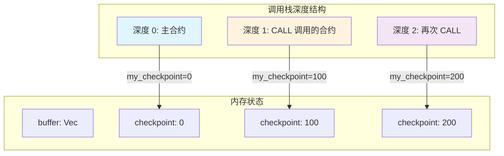
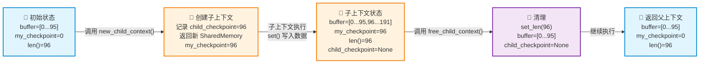
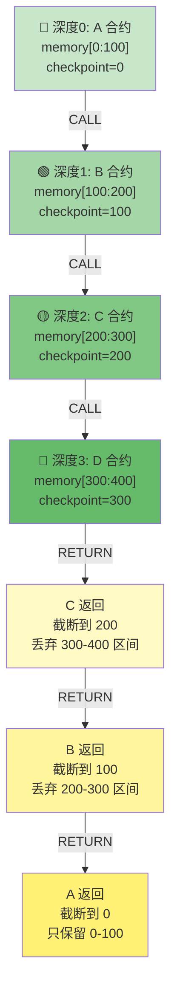

# Revm shared_memory.rs 文件重点
_Exported on 1/22/2026 at 21:21:37 GMT+8 from Cursor (2.3.29)_

---

**User**

@crates/interpreter/src/interpreter/shared_memory.rs:1-582 这个项目是revm，我在学习当前的这个文件，有什么是重点的呢，必须学会和理解的

---

**Cursor**

我来帮你分析这个 `shared_memory.rs` 文件中的重点内容。

好的，现在我来为你梳理 `shared_memory.rs` 这个文件中的核心知识点。这是 REVM 中 EVM 内存管理的实现，有几个**必须理解**的重点：

## 🎯 共享内存（SharedMemory）的核心设计

### **1. 为什么叫"共享"内存？（必学）**

```
SharedMemory 的核心特点：
├─ 通过 Rc<RefCell<Vec<u8>>> 实现引用计数
├─ 支持嵌套调用（call/delegatecall）时内存共享
└─ 每个调用深度有自己的 checkpoint（检查点）
```

关键理解：**在 EVM 的嵌套调用中，所有调用深度共享同一个内存，但每个深度有独立的"视图"**。

### **2. Checkpoint 机制（核心难点）⭐⭐⭐**

```
结构体字段解析：
┌─────────────────────────────────────┐
│ buffer: Rc<RefCell<Vec<u8>>>        │  实际的内存数据
│ my_checkpoint: usize                │  当前上下文的起始位置
│ child_checkpoint: Option<usize>     │  子调用的检查点
└─────────────────────────────────────┘
```

**为什么需要 checkpoint？** 看这个调用场景：

```
调用深度 0（主程序）：
  buffer = [data_0, data_0_continued, ...]
  my_checkpoint = 0

调用深度 1（内部调用）：
  buffer = [data_0, data_0_continued, data_1, data_1_continued, ...]
                                      ↑
                                      my_checkpoint = 原来的length
  
调用返回时，需要：
  free_child_context() 把 buffer 截断回原来的长度
```

### **3. 创建子上下文的过程（第217-231行）**

```rust
pub fn new_child_context(&mut self) -> SharedMemory {
    let new_checkpoint = self.full_len();  // 记住当前长度
    self.child_checkpoint = Some(new_checkpoint);
    
    SharedMemory {
        buffer: Some(self.buffer().clone()),  // 共享同一个 Rc
        my_checkpoint: new_checkpoint,        // 子上下文从这里开始
        child_checkpoint: None,
    }
}
```

**关键点：** 子上下文和父上下文指向 **同一个 Rc**，修改会互相影响。

### **4. 释放子上下文的过程（第235-242行）**

```rust
pub fn free_child_context(&mut self) {
    let Some(child_checkpoint) = self.child_checkpoint.take() else {
        return;  // 没有子上下文，直接返回
    };
    unsafe {
        self.buffer_ref_mut().set_len(child_checkpoint);  // 截断
    }
}
```

**为什么用 unsafe？** 因为直接设置 Vec 的长度，跳过了 Rust 的安全检查。

### **5. 本地/全局内存的两个视角（第244-252行）**

```
┌─────────────────────────────────────────┐
│  buffer 中的内存结构                     │
│ ┌──────────────┬──────────────┐         │
│ │   parent's   │   child's    │         │
│ │   context    │   context    │         │
│ └──────────────┴──────────────┘         │
│ ↑              ↑                        │
│ 0          my_checkpoint               │
└─────────────────────────────────────────┘

len() 返回的是当前上下文的长度 = full_len() - my_checkpoint
```

关键代码：
```rust
pub fn len(&self) -> usize {
    self.full_len() - self.my_checkpoint  // 相对长度
}
```

### **6. 内存访问的核心方法（第268-320行）**

这个文件有两类访问方法：

| 方法 | 作用 | 场景 |
|------|------|------|
| `slice_range()` / `slice_len()` | **本地视角** 访问 | 大多数 MLOAD/MSTORE 指令 |
| `global_slice()` / `global_slice_range()` | **全局视角** 访问 | 子调用读取父上下文的数据 |

**例子（第292-300行）：**
```rust
pub fn slice_range(&self, range: Range<usize>) -> Ref<'_, [u8]> {
    let buffer = self.buffer_ref();
    Ref::map(buffer, |b| {
        match b.get(range.start + self.my_checkpoint..range.end + self.my_checkpoint) {
                ↑↑↑ 关键：加上 my_checkpoint 偏移
            Some(slice) => slice,
            None => debug_unreachable!(...),
        }
    })
}
```

### **7. set_data 函数的职责（第429-432行 和 第504-539行）**

这是个 **跨界面拷贝** 函数：

```rust
pub fn set_data(
    memory_offset: usize,  // 目标偏移
    data_offset: usize,    // 源偏移
    len: usize,            // 长度
    data: &[u8]            // 源数据
)
```

**特殊处理：** 如果源数据不足，会 **补零**（第534-538行）：

```rust
unsafe {
    dst.get_unchecked_mut(dst_offset + src_len..dst_offset + len)
        .fill(0)  // 不足的部分填0
};
```

**为什么这样做？** EVM 的 CALLDATACOPY 等指令需要这种行为。

### **8. 内存相关常量和限制（第44-50行）**

```rust
memory_limit: u64  // 可选特性，限制最大内存
```

**关键用法：** 第207-209行
```rust
pub fn limit_reached(&self, new_size: usize) -> bool {
    self.my_checkpoint.saturating_add(new_size) as u64 > self.memory_limit
}
```

### **9. RefCell 的包装（第11-32行）**

```rust
trait RefcellExt<T> {
    fn dbg_borrow(&self) -> Ref<'_, T>;
    fn dbg_borrow_mut(&self) -> RefMut<'_, T>;
}
```

**为什么？** 在 debug 模式下检查借用冲突，避免 panic：
```rust
fn dbg_borrow(&self) -> Ref<'_, T> {
    match self.try_borrow() {
        Ok(b) => b,
        Err(e) => debug_unreachable!("{e}"),  // 只在 debug 时 unreachable
    }
}
```

### **10. resize_memory 函数（第548-582行）**

这是内存扩展的**核心函数**：

```rust
pub fn resize_memory<Memory: MemoryTr>(
    gas: &mut crate::Gas,
    memory: &mut Memory,
    offset: usize,
    len: usize,
) -> bool {
    let new_num_words = num_words(offset.saturating_add(len));
    // num_words 把字节数舍入到 32 字节边界
    if new_num_words > gas.memory().words_num {
        resize_memory_cold(gas, memory, new_num_words)
    } else {
        true
    }
}
```

**关键：** 使用 `#[cold]` 属性标记 `resize_memory_cold`，告诉编译器这是一个冷路径，不要内联。

---

## 📌 学习重点表

| 知识点 | 重要性 | 掌握方式 |
|--------|--------|--------|
| **Checkpoint 机制** | ⭐⭐⭐ | 理解嵌套调用如何共享内存 |
| **new_child_context** | ⭐⭐⭐ | 手写一个简单版本 |
| **free_child_context** | ⭐⭐⭐ | 理解 unsafe 为什么必要 |
| **本地 vs 全局视角** | ⭐⭐⭐ | 区分 slice_range vs global_slice |
| **set_data 补零** | ⭐⭐ | EVM 语义的实现细节 |
| **RefCell 借用检查** | ⭐⭐ | Rust 内部可变性的应用 |
| **resize_memory 冷路径** | ⭐ | 性能优化的小细节 |

---

## 🚀 实践建议

1. **画一个调用树图** 理解 checkpoint 如何工作
2. **追踪 CALL 指令** 看 new_child_context 和 free_child_context 如何被调用
3. **对比 Stack 和 Memory** 理解两者设计的差异（Stack 是 U256 数组，Memory 是字节数组）

这个文件是理解 **EVM 执行隔离** 的关键！ 🎯

```plaintext
SharedMemory 的核心特点：
├─ 通过 Rc<RefCell<Vec<u8>>> 实现引用计数
├─ 支持嵌套调用（call/delegatecall）时内存共享
└─ 每个调用深度有自己的 checkpoint（检查点）
```

```plaintext
结构体字段解析：
┌─────────────────────────────────────┐
│ buffer: Rc<RefCell<Vec<u8>>>        │  实际的内存数据
│ my_checkpoint: usize                │  当前上下文的起始位置
│ child_checkpoint: Option<usize>     │  子调用的检查点
└─────────────────────────────────────┘
```

```plaintext
调用深度 0（主程序）：
  buffer = [data_0, data_0_continued, ...]
  my_checkpoint = 0

调用深度 1（内部调用）：
  buffer = [data_0, data_0_continued, data_1, data_1_continued, ...]
                                      ↑
                                      my_checkpoint = 原来的length
  
调用返回时，需要：
  free_child_context() 把 buffer 截断回原来的长度
```

```rust
pub fn new_child_context(&mut self) -> SharedMemory {
    let new_checkpoint = self.full_len();  // 记住当前长度
    self.child_checkpoint = Some(new_checkpoint);
    
    SharedMemory {
        buffer: Some(self.buffer().clone()),  // 共享同一个 Rc
        my_checkpoint: new_checkpoint,        // 子上下文从这里开始
        child_checkpoint: None,
    }
}
```

```rust
pub fn free_child_context(&mut self) {
    let Some(child_checkpoint) = self.child_checkpoint.take() else {
        return;  // 没有子上下文，直接返回
    };
    unsafe {
        self.buffer_ref_mut().set_len(child_checkpoint);  // 截断
    }
}
```

```plaintext
┌─────────────────────────────────────────┐
│  buffer 中的内存结构                     │
│ ┌──────────────┬──────────────┐         │
│ │   parent's   │   child's    │         │
│ │   context    │   context    │         │
│ └──────────────┴──────────────┘         │
│ ↑              ↑                        │
│ 0          my_checkpoint               │
└─────────────────────────────────────────┘

len() 返回的是当前上下文的长度 = full_len() - my_checkpoint
```

```rust
pub fn len(&self) -> usize {
    self.full_len() - self.my_checkpoint  // 相对长度
}
```

```rust
pub fn slice_range(&self, range: Range<usize>) -> Ref<'_, [u8]> {
    let buffer = self.buffer_ref();
    Ref::map(buffer, |b| {
        match b.get(range.start + self.my_checkpoint..range.end + self.my_checkpoint) {
                ↑↑↑ 关键：加上 my_checkpoint 偏移
            Some(slice) => slice,
            None => debug_unreachable!(...),
        }
    })
}
```

```rust
pub fn set_data(
    memory_offset: usize,  // 目标偏移
    data_offset: usize,    // 源偏移
    len: usize,            // 长度
    data: &[u8]            // 源数据
)
```

```rust
unsafe {
    dst.get_unchecked_mut(dst_offset + src_len..dst_offset + len)
        .fill(0)  // 不足的部分填0
};
```

```rust
memory_limit: u64  // 可选特性，限制最大内存
```

```rust
pub fn limit_reached(&self, new_size: usize) -> bool {
    self.my_checkpoint.saturating_add(new_size) as u64 > self.memory_limit
}
```

```rust
trait RefcellExt<T> {
    fn dbg_borrow(&self) -> Ref<'_, T>;
    fn dbg_borrow_mut(&self) -> RefMut<'_, T>;
}
```

```rust
fn dbg_borrow(&self) -> Ref<'_, T> {
    match self.try_borrow() {
        Ok(b) => b,
        Err(e) => debug_unreachable!("{e}"),  // 只在 debug 时 unreachable
    }
}
```

```rust
pub fn resize_memory<Memory: MemoryTr>(
    gas: &mut crate::Gas,
    memory: &mut Memory,
    offset: usize,
    len: usize,
) -> bool {
    let new_num_words = num_words(offset.saturating_add(len));
    // num_words 把字节数舍入到 32 字节边界
    if new_num_words > gas.memory().words_num {
        resize_memory_cold(gas, memory, new_num_words)
    } else {
        true
    }
}
```

---

**User**

- 你用mermaid画一个调用树图 理解 checkpoint 如何工作
- 举个简单例子：追踪 CALL 指令 看 new_child_context 和 free_child_context 如何被调用

---

**Cursor**

好的，让我为你画 checkpoint 工作流程的详细图解，并追踪一个真实的 CALL 指令执行。

首先让我查看 CALL 指令的实现，理解它如何与 SharedMemory 交互：

完美！现在让我给你详细的可视化图解和实际追踪。

## 🎯 Checkpoint 工作流程图解

### **整体架构图**



### **详细的 Checkpoint 机制工作图**



---

## 📊 真实 CALL 指令执行追踪

现在用实际的 Solidity 例子来追踪：

### **Solidity 代码示例**

```solidity
// 主合约
contract Parent {
    Child child;
    
    function callChild() public {
        bytes memory data = hex"AA BB CC";
        // 在 memory 中写入数据：memory[0:3] = [0xAA, 0xBB, 0xCC]
        child.doSomething(data);
        // 返回后，memory 应该被清理
    }
}

contract Child {
    function doSomething(bytes memory data) public {
        // 读取 memory 中的数据
        // ...
    }
}
```

### **执行追踪步骤**

#### **步骤 1: Parent.callChild() 执行**

```
时间点 T1: 执行 MSTORE 把 data 写入 memory
┌─────────────────────────────────────────┐
│ Parent 的 SharedMemory                  │
├─────────────────────────────────────────┤
│ buffer = Vec<u8> { [0xAA, 0xBB, 0xCC] }│
│ my_checkpoint = 0                       │  
│ child_checkpoint = None                 │
│ len() = 3                               │
│ full_len() = 3                          │
└─────────────────────────────────────────┘

代码执行（来自 stack.rs 的 set_u256 最终调用 memory.set）：
parent_memory.set(0, &[0xAA, 0xBB, 0xCC])
  ↓
在 buffer[0:3] 写入数据
```

#### **步骤 2: CALL 指令被执行**

```
时间点 T2: 遇到 CALL 指令

代码位置：crates/interpreter/src/instructions/contract.rs:111-155

fn call<WIRE: InterpreterTypes, H: Host + ?Sized>(
    mut context: InstructionContext<'_, H, WIRE>,
) {
    // ... 读取栈上的参数（gas_limit, to, value 等）
    
    // 重要：获取输入数据范围
    let Some((input, return_memory_offset)) = 
        get_memory_input_and_out_ranges(context.interpreter)
    else {
        return;
    };
    
    // 设置 NewFrame 操作
    context
        .interpreter
        .bytecode
        .set_action(InterpreterAction::NewFrame(FrameInput::Call(
            Box::new(CallInputs {
                input: CallInput::SharedBuffer(input),  // 指向 memory 中的数据范围
                // ...
            })
        )));
}
```

此时 **SharedBuffer 包含了对 memory 中 [0:3] 范围的引用**。

#### **步骤 3: 执行器创建新的执行帧**

```
时间点 T3: 执行器（EVM Host）处理 NewFrame

伪代码逻辑：
match action {
    InterpreterAction::NewFrame(frame_input) => {
        // 创建新的执行帧
        let mut child_memory = parent_memory.new_child_context();
        //                                  ↑↑↑ 关键调用！
        
        let frame_init = FrameInit {
            depth: current_depth + 1,
            memory: child_memory,
            frame_input: frame_input,
        };
        
        push_to_frame_stack(frame_init);
    }
}
```

**此时的内存状态：**

```
┌─────────────────────────────────────────────┐
│ Parent SharedMemory（还在栈上）             │
├─────────────────────────────────────────────┤
│ buffer ─┐                                   │
│ my_checkpoint = 0                           │
│ child_checkpoint = Some(3)  ◄── 新设置！    │
│ full_len() = 3                              │
└─────────────────────────────────────────────┘
         │
         │ Rc clone
         ▼
┌─────────────────────────────────────────────┐
│ Child SharedMemory（新创建）                │
├─────────────────────────────────────────────┤
│ buffer ─┐ (同一个 Rc 指向)                 │
│ my_checkpoint = 3  ◄── 关键！从这里开始     │
│ child_checkpoint = None                     │
│ len() = 0 (full_len() - my_checkpoint)      │
└─────────────────────────────────────────────┘
```

#### **步骤 4: Child 合约执行（可能写入更多数据）**

```
时间点 T4: Child.doSomething() 执行

假设 Child 也向 memory 写入数据：
child_memory.set(0, &[0xDD, 0xEE, 0xFF])

从 Child 的视角：
- offset = 0（相对于自己的上下文）
- 实际写入位置 = my_checkpoint + 0 = 3 + 0 = 3

┌─────────────────────────────────────────────┐
│ 共享的 buffer                               │
├─────────────────────────────────────────────┤
│ [0xAA, 0xBB, 0xCC] | [0xDD, 0xEE, 0xFF]    │
│  Parent 的数据      │   Child 的数据        │
│ offset: 0-2          │ offset: 3-5          │
│ my_checkpoint=0     │   my_checkpoint=3    │
└─────────────────────────────────────────────┘

Child 看到的 len() = full_len() - my_checkpoint
           = 6 - 3
           = 3 ✓
```

#### **步骤 5: Child 返回（关键清理步骤）**

```
时间点 T5: Child 执行完毕，返回

pop_frame_stack() 被调用
  ↓
parent_memory.free_child_context()  ◄── 关键清理！

代码（shared_memory.rs:235-242）：
pub fn free_child_context(&mut self) {
    let Some(child_checkpoint) = self.child_checkpoint.take() else {
        return;
    };
    unsafe {
        self.buffer_ref_mut().set_len(child_checkpoint);
        // buffer.set_len(3)
        //   ↑ 把 buffer 截断回 3！
    }
}

执行后：
┌─────────────────────────────────────────────┐
│ Parent 的 SharedMemory                      │
├─────────────────────────────────────────────┤
│ buffer = [0xAA, 0xBB, 0xCC]  ◄── 恢复！     │
│ my_checkpoint = 0                           │
│ child_checkpoint = None                     │
│ len() = 3                                   │
│ full_len() = 3                              │
└─────────────────────────────────────────────┘

⚠️ 注意：[0xDD, 0xEE, 0xFF] 被"隐藏"了！
（实际上内存还在，但通过 Vec::set_len() 标记为"不存在"）
```

---

## 📋 完整时间线表格

| 时间点 | 操作 | Parent 状态 | Child 状态 | buffer 内容 |
|--------|------|-----------|----------|-----------|
| T1 | MSTORE | checkpoint=0, len=3 | - | [AA BB CC] |
| T2 | CALL 指令 | checkpoint=0, child_cp=3 | - | [AA BB CC] |
| T3 | new_child_context | checkpoint=0, child_cp=3 | checkpoint=3, len=0 | [AA BB CC] |
| T4 | Child writes | checkpoint=0, child_cp=3 | checkpoint=3, len=3 | [AA BB CC DD EE FF] |
| T5 | free_child_context | checkpoint=0, child_cp=None | - | [AA BB CC] |

---

## 🎓 核心理解点

### **为什么用 checkpoint 而不是复制内存？**

```
❌ 朴素方案（复制）：
child_memory = parent_memory.clone()  // 复制所有字节
  → 内存消耗翻倍
  → 返回时需要同步修改
  
✅ Checkpoint 方案：
child_memory = parent_memory.new_child_context()  // 只增加偏移量
  → 共享同一个 buffer
  → 返回时简单截断
  → 性能高效！
```

### **RefCell<Vec<u8>> 的必要性**

为什么必须用 `Rc<RefCell<Vec<u8>>>` 而不是 `Rc<Vec<u8>>`？

```rust
// 错误方案：Vec 不可变
Rc<Vec<u8>>  
  → 无法修改内容
  → 无法 set_len()

// 正确方案：RefCell 提供内部可变性
Rc<RefCell<Vec<u8>>>
  → 多个 SharedMemory 可以同时修改同一个 buffer
  → set_len() 在运行时工作
```

---

## 🚀 嵌套调用的更复杂场景



---

好了！现在你已经理解了 checkpoint 的完整工作流程。核心思想就是：

✅ **利用 Vec 的长度特性，通过偏移量而非复制来隔离不同调用深度的内存**
✅ **返回时只需 `set_len()` 截断，O(1) 时间复杂度**
✅ **通过 `Rc<RefCell<>>` 实现多个 SharedMemory 共享同一个底层 buffer**

