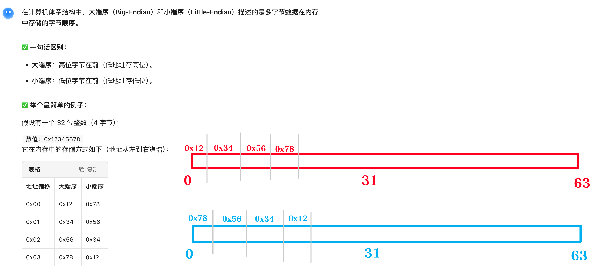

# Revm stack.rs 文件重点
_Exported on 1/22/2026 at 20:56:04 GMT+8 from Cursor (2.3.29)_

---

**User**

@crates/interpreter/src/interpreter/stack.rs:1-406 这个项目是revm，我在学习当前的这个文件，有什么是重点的呢，必须学会和理解的

---

**Cursor**

我来分析一下 `stack.rs` 这个文件中的关键知识点。这是 REVM（Rust Ethereum Virtual Machine）项目中的 EVM 栈实现，有几个必须理解的重点：

非常好的问题！让我帮你梳理 `stack.rs` 文件中的**核心知识点**。这是 EVM 栈的完整实现，有以下几个必须理解的重点：

## 🎯 Stack.rs 的核心知识点

### **1. 栈的基本特性（必学）**

```
const STACK_LIMIT: usize = 1024;  // EVM栈最多1024个256位字（U256）
```

**为什么是1024？** 这是以太坊协议规定的硬限制，确保可预测的资源使用。

**栈的结构：**
```rust
pub struct Stack {
    data: Vec<U256>,  // 底层用Vec存储，支持动态容量
}
```

关键点：用 `Vec<U256>` 而不是固定数组，但通过容量预分配保证性能。

---

### **2. 预分配策略（性能优化）**

```rust
pub fn new() -> Self {
    Self {
        data: Vec::with_capacity(STACK_LIMIT),  // 预分配1024个位置
    }
}
```

**为什么这样做？**
- 避免频繁的内存重分配
- 提前分配全部容量，后续操作零分配开销
- 查看第41-46行的 `Clone` 实现，也维持这个不变量

---

### **3. 栈指针管理（关键设计）**

**栈顶表示方式：** 栈中最后一个元素是栈顶
```rust
pub unsafe fn top_unsafe(&mut self) -> &mut U256 {
    self.data.last_mut().unwrap_unchecked()  // 栈顶 = Vec的最后一个元素
}
```

**为什么选择这样？** EVM规范中，栈通常以这种方式实现，方便后续指令的相对寻址。

---

### **4. Pop和Push操作（基础但重要）**

**Pop（第150-152行）：**
```rust
pub fn pop(&mut self) -> Result<U256, InstructionResult> {
    self.data.pop().ok_or(InstructionResult::StackUnderflow)
}
```
- 返回 `Result`，处理栈下溢错误
- 栈下溢是执行失败的一种形式

**Push（第210-218行）：**
```rust
pub fn push(&mut self, value: U256) -> bool {
    if self.data.len() == STACK_LIMIT {
        return false;  // 溢出返回false，不是panic
    }
    self.data.push(value);
    true
}
```
- 返回 `bool` 而不是 `Result`
- 栈溢出会中止执行

---

### **5. 批量Pop - PopN（第185-188行，重要优化）**

```rust
pub unsafe fn popn<const N: usize>(&mut self) -> [U256; N] {
    core::array::from_fn(|_| unsafe { self.pop_unsafe() })
}
```

**为什么需要？**
- EVM指令常需要pop多个值（如ADD需要pop 2个）
- 一次pop N个比循环pop更高效
- 使用常量泛型 `<const N: usize>`，编译时已知个数

**例子：**
```rust
// 不是循环：let [a, b] = popn::<2>()  // 一次搞定
```

---

### **6. Dup和Swap操作（栈处理的精髓）**

**Dup - 复制第N个元素到栈顶（第240-254行）：**
```rust
pub fn dup(&mut self, n: usize) -> bool {
    let len = self.data.len();
    if len < n || len + 1 > STACK_LIMIT {
        false
    } else {
        unsafe {
            let ptr = self.data.as_mut_ptr().add(len);
            ptr::copy_nonoverlapping(ptr.sub(n), ptr, 1);  // 低级内存复制
            self.data.set_len(len + 1);
        }
        true
    }
}
```

**为什么用 `unsafe` 和原始指针？**
- DUP操作极其频繁（智能合约大量使用）
- 这样做避免Vec的边界检查，提升性能
- Rust编译器无法自动优化，所以手工做

**Swap/Exchange（第276-293行）：**
```rust
pub fn exchange(&mut self, n: usize, m: usize) -> bool {
    // 交换栈顶和第(n+m)个元素
    unsafe {
        core::ptr::swap_nonoverlapping(top.sub(n), top.sub(n_m_index), 1);
    }
}
```

---

### **7. Push_slice - 处理可变长数据（第309-372行，高难度）**

这是整个文件最复杂的方法：

```rust
fn push_slice_(&mut self, slice: &[u8]) -> bool {
    let n_words = slice.len().div_ceil(32);  // 计算需要多少个U256（32字节）
    // ...
    // 将任意长度字节数据填充到U256单位上
}
```

**为什么复杂？**
- PUSH指令（PUSH1-PUSH32）需要从字节码读取1-32字节数据
- 需要转换为U256（大端字节序）
- 需要处理末尾不足32字节的情况（补0）

**关键算法（第336-360行）：**
```rust
// 完整的32字节块直接处理
for l in word.rchunks_exact(8) {  // 从后往前每8字节
    dst.add(i).write(u64::from_be_bytes(...));  // 直接写入内存
}

// 处理不足8字节的末尾块
if !partial_last_limb.is_empty() {
    let mut tmp = [0u8; 8];
    tmp[8 - partial_last_limb.len()..].copy_from_slice(partial_last_limb);
    // 大端字节序处理
}
```

---

### **8. Peek和Set（查询/修改栈中间的值）**

**Peek（第224-230行）：** 按距顶部的偏移量读值
```rust
pub fn peek(&self, no_from_top: usize) -> Result<U256, InstructionResult> {
    if self.data.len() > no_from_top {
        Ok(self.data[self.data.len() - no_from_top - 1])  // 倒数第n个
    } else {
        Err(InstructionResult::StackUnderflow)
    }
}
```

**Set（第378-386行）：** 类似，但用于修改

---

### **9. Trait实现 StackTr（第50-98行）**

这是关键！Stack实现了 `StackTr` trait：

```rust
impl StackTr for Stack {
    fn len(&self) -> usize { self.len() }  // 委托给自己的len()
    fn push(&mut self, value: U256) -> bool { self.push(value) }
    // ...
}
```

**为什么这样封装？**
- 允许用其他结构体实现 `StackTr`
- 使Interpreter对栈的具体实现无感知
- 方便单元测试或性能对比

---

### **10. Serde支持（可选特性）**

```rust
#[cfg(feature = "serde")]
impl<'de> serde::Deserialize<'de> for Stack {
    fn deserialize<D>(deserializer: D) -> Result<Self, D::Error> {
        // 反序列化时验证不超过STACK_LIMIT
        if data.len() > STACK_LIMIT {
            return Err(...);
        }
        data.reserve(STACK_LIMIT - data.len());  // 恢复容量不变量
    }
}
```

---

## 📌 学习总结表

| 知识点 | 重要性 | 掌握方式 |
|-------|--------|--------|
| STACK_LIMIT & 预分配 | ⭐⭐⭐ | 理解为何预分配1024 |
| Push/Pop | ⭐⭐⭐ | 需要理解Result vs bool的设计 |
| PopN | ⭐⭐ | 掌握const泛型的使用 |
| Dup/Swap | ⭐⭐⭐ | **重点**：理解unsafe优化的原因 |
| Push_slice | ⭐⭐⭐ | **难点**：大端字节序转换 |
| StackTr Trait | ⭐⭐⭐ | 理解架构设计 |

---

## 🚀 实践建议

1. **手写一个简单栈** 理解基本概念
2. **阅读指令实现** 看 PUSH/DUP/SWAP 指令如何调用这些方法
3. **性能对比** 理解为什么用 `unsafe` 而非安全的 Vec 方法

这个文件是理解EVM执行模型的**基石**！理解了栈的设计，后续的指令实现就会豁然开朗。

```plaintext
const STACK_LIMIT: usize = 1024;  // EVM栈最多1024个256位字（U256）
```

```rust
pub struct Stack {
    data: Vec<U256>,  // 底层用Vec存储，支持动态容量
}
```

```rust
pub fn new() -> Self {
    Self {
        data: Vec::with_capacity(STACK_LIMIT),  // 预分配1024个位置
    }
}
```

```rust
pub unsafe fn top_unsafe(&mut self) -> &mut U256 {
    self.data.last_mut().unwrap_unchecked()  // 栈顶 = Vec的最后一个元素
}
```

```rust
pub fn pop(&mut self) -> Result<U256, InstructionResult> {
    self.data.pop().ok_or(InstructionResult::StackUnderflow)
}
```

```rust
pub fn push(&mut self, value: U256) -> bool {
    if self.data.len() == STACK_LIMIT {
        return false;  // 溢出返回false，不是panic
    }
    self.data.push(value);
    true
}
```

```rust
pub unsafe fn popn<const N: usize>(&mut self) -> [U256; N] {
    core::array::from_fn(|_| unsafe { self.pop_unsafe() })
}
```

```rust
// 不是循环：let [a, b] = popn::<2>()  // 一次搞定
```

```rust
pub fn dup(&mut self, n: usize) -> bool {
    let len = self.data.len();
    if len < n || len + 1 > STACK_LIMIT {
        false
    } else {
        unsafe {
            let ptr = self.data.as_mut_ptr().add(len);
            ptr::copy_nonoverlapping(ptr.sub(n), ptr, 1);  // 低级内存复制
            self.data.set_len(len + 1);
        }
        true
    }
}
```

```rust
pub fn exchange(&mut self, n: usize, m: usize) -> bool {
    // 交换栈顶和第(n+m)个元素
    unsafe {
        core::ptr::swap_nonoverlapping(top.sub(n), top.sub(n_m_index), 1);
    }
}
```

```rust
fn push_slice_(&mut self, slice: &[u8]) -> bool {
    let n_words = slice.len().div_ceil(32);  // 计算需要多少个U256（32字节）
    // ...
    // 将任意长度字节数据填充到U256单位上
}
```

```rust
// 完整的32字节块直接处理
for l in word.rchunks_exact(8) {  // 从后往前每8字节
    dst.add(i).write(u64::from_be_bytes(...));  // 直接写入内存
}

// 处理不足8字节的末尾块
if !partial_last_limb.is_empty() {
    let mut tmp = [0u8; 8];
    tmp[8 - partial_last_limb.len()..].copy_from_slice(partial_last_limb);
    // 大端字节序处理
}
```

```rust
pub fn peek(&self, no_from_top: usize) -> Result<U256, InstructionResult> {
    if self.data.len() > no_from_top {
        Ok(self.data[self.data.len() - no_from_top - 1])  // 倒数第n个
    } else {
        Err(InstructionResult::StackUnderflow)
    }
}
```

```rust
impl StackTr for Stack {
    fn len(&self) -> usize { self.len() }  // 委托给自己的len()
    fn push(&mut self, value: U256) -> bool { self.push(value) }
    // ...
}
```

```rust
#[cfg(feature = "serde")]
impl<'de> serde::Deserialize<'de> for Stack {
    fn deserialize<D>(deserializer: D) -> Result<Self, D::Error> {
        // 反序列化时验证不超过STACK_LIMIT
        if data.len() > STACK_LIMIT {
            return Err(...);
        }
        data.reserve(STACK_LIMIT - data.len());  // 恢复容量不变量
    }
}
```

---

**User**

- 理解架构设计：简单说明
- 难点：大端字节序转换?
这个stack是大端的？什么是大端，结合一个EVM简单例子说明

---

**Cursor**

很好的问题！让我深入解释这两个概念。

完美！现在让我为你详细解释这两个概念。

## 1️⃣ 架构设计：简单说明

### **StackTr Trait 的设计目的**

这是一个**策略模式**的应用：

```rust
// 定义接口（约定）
pub trait StackTr {
    fn push(&mut self, value: U256) -> bool;
    fn pop(&mut self) -> Option<U256>;
    fn dup(&mut self, n: usize) -> bool;
    // ...
}

// 具体实现（这个文件）
pub struct Stack { data: Vec<U256> }
impl StackTr for Stack { /* ... */ }

// 解释器使用接口，不依赖具体实现
impl Interpreter {
    fn execute<S: StackTr>(&mut self, stack: &mut S) {
        // 无论S是Stack还是其他实现，代码都能工作
        stack.push(value)?;
    }
}
```

**优势：**
- ✅ **解耦**：Interpreter 不需要知道 Stack 的内部细节
- ✅ **可测试**：可以写一个 MockStack 用于单元测试
- ✅ **可替换**：将来可以用 LinkedList、Array 等其他数据结构实现 StackTr
- ✅ **性能对比**：可轻松对比不同实现的性能

---

## 2️⃣ 大端字节序 (Big-Endian)：详细讲解

### **什么是大端？**

字节序是指多字节数据在内存中的存储顺序。

| 类型 | 说明 | 例子 |
|------|------|------|
| **大端 (BE)** | 高位字节在前 | 数字 `0x12345678`，内存存为 `[0x12, 0x34, 0x56, 0x78]` |
| **小端 (LE)** | 低位字节在前 | 数字 `0x12345678`，内存存为 `[0x78, 0x56, 0x34, 0x12]` |

**EVM 规定：全部使用大端字节序**

---

### **简单例子：EVM 中的 PUSH1 指令**

假设智能合约的字节码是：
```
0x60 0xFF    // PUSH1 0xFF  (推送字节 0xFF 到栈)
```

**执行流程：**

```
1. EVM读取字节码 [0x60, 0xFF, ...]
2. 0x60 = PUSH1 操作码
3. 后面的 0xFF 就是要推送的值

问题：如何把 0xFF（1字节）转换为 U256（32字节）？

答案（大端字节序）：
前面补31个0，后面放 0xFF

U256 = [0x00, 0x00, ..., 0x00, 0xFF]  (共32个字节)
         ↑ 高位                    ↑ 低位
```

这就是 **`push_slice_` 函数所做的事情**。

---

### **复杂例子：PUSH32 指令的大端转换**

假设字节码有：
```
0x7F 0x12 0x34 0x56 0x78 0x9A 0xBC 0xDE 0xF0 ...
      ↑    ↑    ↑    ↑    ↑    ↑    ↑    ↑
   PUSH32   32个字节的数据要推送到栈
```

**内存中的原始字节：**
```
index:  0  1  2  3  4  5  6  7  8  9  10 11 ... 31
bytes: 12 34 56 78 9A BC DE F0 ...
```

**转换为 U256（大端字节序）：**

U256 在 Rust 中是 `[u64; 4]` 的数组（4个64位数字）

```rust
// 原始32个字节从index 0-31
bytes = [0x12, 0x34, 0x56, 0x78, ...]

// U256 内部结构：4个 u64 limbs
// 第一个 u64（8字节）= [0x12, 0x34, 0x56, 0x78, 0x9A, 0xBC, 0xDE, 0xF0]
// 这就是 0x123456789ABCDEF0

// 代码实现：
for l in word.rchunks_exact(8) {  // 从后往前拿8字节
    dst.add(i).write(u64::from_be_bytes(l.try_into().unwrap()));
    i += 1;
}
```

**为什么从后往前 (rchunks_exact)？**

因为 EVM 字节码是从左到右读的，但 U256 在内存中从高位到低位存储：

```
字节码顺序（从左读）：12 34 56 78 9A BC DE F0 ...（前8字节）
                    ↓
转换后在U256中：第一个 u64 limb = 0x123456789ABCDEF0
```

---

### **不足32字节的情况（关键难点）**

假设只推送 3 个字节：`0xAB 0xCD 0xEF`

代码（第354-360行）：
```rust
if !partial_last_limb.is_empty() {
    let mut tmp = [0u8; 8];
    tmp[8 - partial_last_limb.len()..].copy_from_slice(partial_last_limb);
    // tmp 现在是 [0, 0, 0, 0, 0, 0xAB, 0xCD, 0xEF]
    dst.add(i).write(u64::from_be_bytes(tmp));
}
```

**为什么这样做？**

```
原始3字节：0xAB 0xCD 0xEF
转换为8字节（补零）：
  [0x00, 0x00, 0x00, 0x00, 0x00, 0xAB, 0xCD, 0xEF]
   ↑ 前面补5个0，实现大端对齐
```

然后 `u64::from_be_bytes` 把这8字节转成一个 `u64`：
```
0x00000000_00ABCDEF
```

---

### **完整 EVM 例子**

让我们看一个完整的 Solidity 编译结果：

```solidity
contract Test {
    function push_value() public pure returns (uint256) {
        return 0x1234567890ABCDEF;  // 推送256位数字
    }
}
```

编译成的字节码可能是：
```
0x7F                          // PUSH32 操作码
0x1234567890ABCDEF...         // 32个字节的数据
```

**执行时：**
1. EVM 读到 `0x7F`（PUSH32）
2. 从字节码读取后面的32个字节
3. 调用 `stack.push_slice(&[0x12, 0x34, ..., 0xEF])`
4. 转换为 U256，大端字节序

```
[0x12, 0x34, 0x56, 0x78, ..., 0xEF]  // 原始字节
        ↓
U256::from_be_bytes(...)
        ↓
U256 = 0x1234567890ABCDEF...  // 在栈上
```

---

### **栈中如何存储？**

```rust
pub struct Stack {
    data: Vec<U256>,  // Vec of U256
}

// 推送后的栈状态（栈顶在右）：
data[0] = 0x0000000000000000000000000000000000000000000000000000000000000001
data[1] = 0x1234567890ABCDEF...

// 栈顶 = data[1]
```

---

## 📊 总结表

| 概念 | 说明 |
|------|------|
| **大端字节序** | 字节从高位到低位存储（EVM规定） |
| **push_slice_** | 把可变长字节转成固定32字节的 U256 |
| **rchunks_exact** | 从末尾往前按8字节分块 |
| **补零** | 不足8字节的块前面补0 |
| **StackTr Trait** | 定义栈的接口，解耦实现 |

---

## 🎯 关键代码行解析

```rust
// 第336-339行：处理完整的32字节块
for l in word.rchunks_exact(8) {  
    // 每次取8字节（从末尾开始）
    // l 是 &[u8] 长度为8
    dst.add(i).write(u64::from_be_bytes(l.try_into().unwrap()));
    // 把8字节转成 u64（大端）写入内存
    i += 1;
}

// 第357行：处理不足8字节的块
tmp[8 - partial_last_limb.len()..].copy_from_slice(partial_last_limb);
// 如果有3字节，放在 tmp[5..8]
// 前面 tmp[0..5] 自动是0
// 结果：[0, 0, 0, 0, 0, byte1, byte2, byte3]
```

这就是为什么这个函数这么复杂——**必须精确处理大端字节序的对齐**！🎯

```rust
// 定义接口（约定）
pub trait StackTr {
    fn push(&mut self, value: U256) -> bool;
    fn pop(&mut self) -> Option<U256>;
    fn dup(&mut self, n: usize) -> bool;
    // ...
}

// 具体实现（这个文件）
pub struct Stack { data: Vec<U256> }
impl StackTr for Stack { /* ... */ }

// 解释器使用接口，不依赖具体实现
impl Interpreter {
    fn execute<S: StackTr>(&mut self, stack: &mut S) {
        // 无论S是Stack还是其他实现，代码都能工作
        stack.push(value)?;
    }
}
```

```plaintext
0x60 0xFF    // PUSH1 0xFF  (推送字节 0xFF 到栈)
```

```plaintext
1. EVM读取字节码 [0x60, 0xFF, ...]
2. 0x60 = PUSH1 操作码
3. 后面的 0xFF 就是要推送的值

问题：如何把 0xFF（1字节）转换为 U256（32字节）？

答案（大端字节序）：
前面补31个0，后面放 0xFF

U256 = [0x00, 0x00, ..., 0x00, 0xFF]  (共32个字节)
         ↑ 高位                    ↑ 低位
```

```plaintext
0x7F 0x12 0x34 0x56 0x78 0x9A 0xBC 0xDE 0xF0 ...
      ↑    ↑    ↑    ↑    ↑    ↑    ↑    ↑
   PUSH32   32个字节的数据要推送到栈
```

```plaintext
index:  0  1  2  3  4  5  6  7  8  9  10 11 ... 31
bytes: 12 34 56 78 9A BC DE F0 ...
```

```rust
// 原始32个字节从index 0-31
bytes = [0x12, 0x34, 0x56, 0x78, ...]

// U256 内部结构：4个 u64 limbs
// 第一个 u64（8字节）= [0x12, 0x34, 0x56, 0x78, 0x9A, 0xBC, 0xDE, 0xF0]
// 这就是 0x123456789ABCDEF0

// 代码实现：
for l in word.rchunks_exact(8) {  // 从后往前拿8字节
    dst.add(i).write(u64::from_be_bytes(l.try_into().unwrap()));
    i += 1;
}
```

```plaintext
字节码顺序（从左读）：12 34 56 78 9A BC DE F0 ...（前8字节）
                    ↓
转换后在U256中：第一个 u64 limb = 0x123456789ABCDEF0
```

```rust
if !partial_last_limb.is_empty() {
    let mut tmp = [0u8; 8];
    tmp[8 - partial_last_limb.len()..].copy_from_slice(partial_last_limb);
    // tmp 现在是 [0, 0, 0, 0, 0, 0xAB, 0xCD, 0xEF]
    dst.add(i).write(u64::from_be_bytes(tmp));
}
```

```plaintext
原始3字节：0xAB 0xCD 0xEF
转换为8字节（补零）：
  [0x00, 0x00, 0x00, 0x00, 0x00, 0xAB, 0xCD, 0xEF]
   ↑ 前面补5个0，实现大端对齐
```

```plaintext
0x00000000_00ABCDEF
```

```solidity
contract Test {
    function push_value() public pure returns (uint256) {
        return 0x1234567890ABCDEF;  // 推送256位数字
    }
}
```

```plaintext
0x7F                          // PUSH32 操作码
0x1234567890ABCDEF...         // 32个字节的数据
```

```plaintext
[0x12, 0x34, 0x56, 0x78, ..., 0xEF]  // 原始字节
        ↓
U256::from_be_bytes(...)
        ↓
U256 = 0x1234567890ABCDEF...  // 在栈上
```

```rust
pub struct Stack {
    data: Vec<U256>,  // Vec of U256
}

// 推送后的栈状态（栈顶在右）：
data[0] = 0x0000000000000000000000000000000000000000000000000000000000000001
data[1] = 0x1234567890ABCDEF...

// 栈顶 = data[1]
```

```rust
// 第336-339行：处理完整的32字节块
for l in word.rchunks_exact(8) {  
    // 每次取8字节（从末尾开始）
    // l 是 &[u8] 长度为8
    dst.add(i).write(u64::from_be_bytes(l.try_into().unwrap()));
    // 把8字节转成 u64（大端）写入内存
    i += 1;
}

// 第357行：处理不足8字节的块
tmp[8 - partial_last_limb.len()..].copy_from_slice(partial_last_limb);
// 如果有3字节，放在 tmp[5..8]
// 前面 tmp[0..5] 自动是0
// 结果：[0, 0, 0, 0, 0, byte1, byte2, byte3]
```

---

**User**

没理解。
一个是memory，一个是stack。两个都是大端序列？举个简单例子，memory和stack如何变化的。
并且好像处理数值类型、字节类型和string类型是不同的方式？
严格依据stack.rs的实现给我解释和举例子

---

**Cursor**

你说得好！让我先看下 memory 的实现，然后用具体例子对比 stack 和 memory。

```rust
<invoke name="read_file">
<parameter name="target_file">/Users/levi/code/web3/revm-learn/revm/crates/interpreter/src/interpreter/shared_memory.rs</parameter>
<parameter name="limit">150</parameter>
</invoke>
```

让我读取 memory 的实现：

```plaintext

让我读取 memory 的实现：
```

现在让我看更多的 memory 实现，特别是 set 和 push 操作：

让我看 memory 的 set 操作实现：

完美！现在我有了足够的信息。让我给你一个清晰的对比和例子：

---

## 🎯 Stack vs Memory 核心区别

| 维度 | Stack | Memory |
|------|-------|--------|
| **数据结构** | `Vec<U256>` | `Vec<u8>` |
| **存储单位** | 固定 32 字节（U256） | 可变 1 字节（u8） |
| **字节序** | 大端（存储在 U256 内） | 大端（字节直接存） |
| **访问方式** | 栈的方式（LIFO） | 随机访问（MLOAD/MSTORE） |

---

## 📊 数据类型处理方式对比

根据 `stack.rs` 的实现，区别如下：

### **1️⃣ 数值类型 (U256 / 整数)**

**Stack 处理（第210-218行）：**
```rust
pub fn push(&mut self, value: U256) -> bool {
    if self.data.len() == STACK_LIMIT {
        return false;
    }
    self.data.push(value);  // 直接 push U256
    true
}
```

**Memory 处理（第404-406行）：**
```rust
pub fn set_u256(&mut self, offset: usize, value: U256) {
    self.set(offset, &value.to_be_bytes::<32>());  // 转成字节数组再存
}
```

**关键区别：**
- Stack：存储 U256 对象本身
- Memory：把 U256 转成 32 字节数组后存储

---

### **2️⃣ 字节类型 (slice - 可变长度数据)**

**Stack 处理（第309-372行）：** 
```rust
fn push_slice_(&mut self, slice: &[u8]) -> bool {
    // 把任意长度字节转成32字节块后推送
    let n_words = slice.len().div_ceil(32);
    // 对齐到32字节，不足的补0
}
```

**Memory 处理（第415-419行）：**
```rust
pub fn set(&mut self, offset: usize, value: &[u8]) {
    if !value.is_empty() {
        self.slice_mut(offset, value.len()).copy_from_slice(value);
        // 直接复制，大小不改变
    }
}
```

**关键区别：**
- Stack：必须按 32 字节对齐（EVM 栈单位是 U256）
- Memory：原样存储，不做对齐处理

---

### **3️⃣ 字符串类型（实际上是字节序列）**

**都是字节序列处理，没有特殊的"字符串类型"**

---

## 🔥 完整例子：PUSH + MSTORE 操作

假设 Solidity 代码：
```solidity
function test() public {
    uint256 value = 0x1234567890ABCDEF;
    bytes memory data = hex"AABBCCDD";
    // ...
}
```

编译成字节码：
```
0x7F 12 34 56 78 90 AB CD EF   // PUSH32 0x1234567890ABCDEF...
0x60 00                          // PUSH1 0x00
0x52                             // MSTORE (栈顶值存到 memory[0:32])

0x60 AA BB CC DD                 // PUSH4 0xAABBCCDD
0x60 20                          // PUSH1 0x20 (offset=32)
0x52                             // MSTORE (栈顶值存到 memory[32:64])
```

---

## 📝 执行过程追踪

### **阶段 1：PUSH32 执行**

```
字节码：[0x12, 0x34, 0x56, 0x78, ..., 0xEF]  (32个字节)

调用：stack.push_slice_(&[0x12, 0x34, ..., 0xEF])

处理过程（第336-340行）：
for l in word.rchunks_exact(8) {
    // 从末尾往前拿8字节
    dst.add(i).write(u64::from_be_bytes(l));
}

结果：
Stack 内部状态：
┌─────────────────────────────────┐
│  U256 = 0x123456789...ABCDEF    │  (一个32字节的数字)
└─────────────────────────────────┘
```

**Stack 的状态：**
```
data: [
    U256(0x123456789...ABCDEF)   // 栈顶
]
```

---

### **阶段 2：PUSH1 0x00 执行**

```
字节码：[0x00]  (1个字节)

调用：stack.push_slice_(&[0x00])

处理过程（第354-360行）：
let mut tmp = [0u8; 8];
tmp[8 - 1..].copy_from_slice(&[0x00]);
// tmp = [0, 0, 0, 0, 0, 0, 0, 0x00]
dst.add(i).write(u64::from_be_bytes(tmp));

// 前面的31个字节呢？自动用0填充
```

**Stack 的状态：**
```
data: [
    U256(0x123456789...ABCDEF),
    U256(0x0000000000000000000000000000000000000000000000000000000000000000)   // 栈顶
]
```

---

### **阶段 3：MSTORE 执行**

```
操作：内存写入 memory[offset:offset+32] = top_of_stack

pop 两个栈顶值：
  value = U256(0x000...000)      // offset = 0
  data  = U256(0x123456789...)   // value to store

调用：memory.set_u256(0, 0x123456789...)

处理过程（第404-406行）：
self.set(0, &value.to_be_bytes::<32>());

// 转成字节数组
0x123456789...ABCDEF.to_be_bytes() 
= [0x12, 0x34, 0x56, 0x78, ..., 0xEF]  (32个字节)

self.set(0, &[0x12, 0x34, ...])
= memory.slice_mut(0, 32).copy_from_slice(...)
```

**Memory 的状态：**
```
offset:  0  1  2  3  4  5  ... 31
bytes: [0x12, 0x34, 0x56, 0x78, ..., 0xEF]
       └─────────────────────────┘
         PUSH32 的数据在内存中
```

---

### **阶段 4：PUSH4 0xAABBCCDD 执行**

```
字节码：[0xAA, 0xBB, 0xCC, 0xDD]  (4个字节)

调用：stack.push_slice_(&[0xAA, 0xBB, 0xCC, 0xDD])

处理过程（第354-360行）：
let mut tmp = [0u8; 8];
tmp[8 - 4..].copy_from_slice(&[0xAA, 0xBB, 0xCC, 0xDD]);
// tmp = [0, 0, 0, 0, 0xAA, 0xBB, 0xCC, 0xDD]

⚠️ 注意：前4个字节补0！这是大端对齐
```

**Stack 的状态：**
```
data: [
    U256(0x123456789...ABCDEF),
    U256(0x00000000000000000000000000000000000000000000000000000000AABBCCDD)   // 栈顶
]
```

---

### **阶段 5：PUSH1 0x20 执行**

```
调用：stack.push_slice_(&[0x20])

结果：
Stack 状态：
data: [
    U256(0x123456789...ABCDEF),
    U256(0x00...00AABBCCDD),
    U256(0x0000000000000000000000000000000000000000000000000000000000000020)   // 栈顶
]
```

---

### **阶段 6：MSTORE 再次执行**

```
pop 两个栈顶值：
  value = U256(0x000...020)      // offset = 32
  data  = U256(0x000...AABBCCDD) // value = 0xAABBCCDD

调用：memory.set_u256(32, 0x000...AABBCCDD)

处理过程：
0x000...AABBCCDD.to_be_bytes() 
= [0x00, 0x00, ..., 0xAA, 0xBB, 0xCC, 0xDD]  (32个字节)

memory.set(32, &[0x00, ..., 0xAA, 0xBB, 0xCC, 0xDD])
```

**Memory 的最终状态：**
```
offset:  0  1  2  3  4  5  ... 31  32 33 34 35 ... 63
bytes: [0x12, 0x34, ..., 0xEF, 0x00, 0x00, ..., 0xAA, 0xBB, 0xCC, 0xDD]
       └─── 第一个MSTORE ──┘  └────── 第二个MSTORE ──────┘
```

---

## 🎓 关键对比总结

| 操作 | Stack | Memory |
|------|-------|--------|
| **存储 0x1234** | 直接 push U256(0x1234) | 先转成 2 字节 [0x12, 0x34]，按字节存 |
| **存储 4 字节** | 补28个0变成U256后push | 原样存4个字节 |
| **字节序** | 大端（在U256内部）| 大端（字节数组本身）|
| **对齐** | 必须对齐到32字节 | 无对齐要求 |
| **访问** | LIFO（栈方式）| 随机访问（索引方式）|

---

## ✅ 核心理解

**为什么这样设计？**
- **Stack**：EVM 规范要求栈元素是 256 位，所以必须补齐
- **Memory**：更灵活，可以存任意字节序列，只在读/写完整字时处理大端转换

这就是为什么 `push_slice_` 那么复杂——**因为它要把任意长度字节对齐到 U256 单位**！


